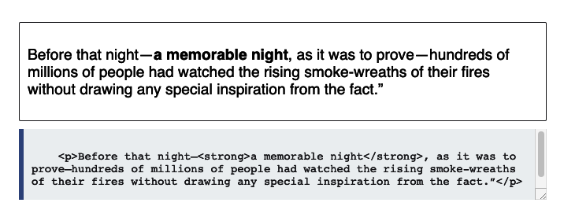

# Normal Flow 안의 block, inline layout (+ Margin Collapsing) - 4

- [https://developer.mozilla.org/en-US/docs/Web/CSS/CSS_Flow_Layout/Block_and_Inline_Layout_in_Normal_Flow](https://developer.mozilla.org/en-US/docs/Web/CSS/CSS_Flow_Layout/Block_and_Inline_Layout_in_Normal_Flow)

- [https://www.w3.org/TR/CSS2/visuren.html#normal-flow](https://www.w3.org/TR/CSS2/visuren.html#normal-flow)

CSS 2.1 스펙에 의하면, normal flow 안에 있는 모든 박스들은 __formatting context__ 에 속한다.

- inline formatting context
- block formatting context

 둘 중에 하나임 (두 context가 같이 쓰이는 경우는 없음)

스펙에 적혀져 있는 두 context의 행동을 정리해보면:

- block formatting context 안에서 (9.4.1)

  - containing block의 top으로부터 시작해서, 박스는 __수직__으로 차례차례 쌓여간다.
  - 박스 사이에 수직 간격는 margin에 의해 결정이 된다.
  - block-level 박스의 수직 margin은 collapse 된다.
  - block-levle 박스의 왼쪽 바깥쪽 경계 (left outer edge)는 containing block의 왼쪽 경계를 접한다.

- inline formatting context 안에서 (9.4.2)

  - containing block의 top으로부터 시작해서, 박스들은 차례 차례 __수평__으로 쌓여간다.
  - 수평 margin, border, padding 은 박스에 영향이 있다. (respected)
    > The top and bottom margins have no effect on non-replaced inline elements, such as  or <code>.
    - 수직 margin 같은 경우 inline 에 영향이 없음. 수직 border 는 효과 있음.

> CSS 2.1은 document를 위에서 아래로 내려가는 horizontal writing mode 를 상정하지만, __vertical writing mode__ 에서 위의 행동들은 방향만 바꿔서 똑같이 적용됨.

## Block Formatting Context

- 기본적으로 block element들은 inline direction에 있는 모든 공간을 차지한다.
- width를 따로 설정해 주어서 다음 block이 옆에 들어올 자리가 있다고 해도 다음 block은 밑에 위치한다.

### Margin collapsing

위해서도 말했듯이 block element 사이의 vertical margin은 collapse 된다.

- 두 형제 block element 사이의 경우: margin-bottom: 30px (element 1) + margin-top: 40px (elemnt 2) = 실 margin 40px
- 부모와 자식 block element 사이의 경우 (둘 사이에 border, padding, content 가 없는 경우): margin-top: 30px (부모) + margin-top: 40px (자식) = margin-top: 40px이 __부모 위에 잡힌다__
- [https://stackoverflow.com/questions/19718634/how-to-disable-margin-collapsing](https://stackoverflow.com/questions/19718634/how-to-disable-margin-collapsing) 를 보면 margin-collpasing을 비활성화 하는 방법을 소개한다.

## Inline Formatting Context

- 모든 inline element 들은 박스를 가지고 있다.
- containing block에 자리가 부족할 경우, inline box는 다음 줄로 넘어간다.
- inline box를 포함 하는 줄도 line-box를 가진다.

- 위의 예시에서 `<strong>`에 포함되지 않는 글자들은  `이름없는 상자들 (anonymoous boxes)`를 가진다고 한다. (개발자가 target해서 조정할수는 없지만, 모든 element들이 박스에 속하게 하기 위해 사용됨)
- line box의 height는 내포하는 상자중 가장 큰 상자에 의해 정의 된다.

## display 프라퍼티와 flow 레이아웃

- `display` 프라퍼티는 해당 element의 외부 display type 을 정의한다 (형제 element 사이에서 어떻게 동작하는지)
- `display` 프라퍼티는 해당 element의 내부 display type 을 정의한다 (자식 element들이 어떻게 동작하는지)

예를 들어, `display: flex`의 경우 외부적으로는 `block` 형태의 display type을 가지고  
내부적으로 자식들은 `flex` 형태의 dispaly type을 가지게 된다.

> Therefore you can think of every box in CSS working in this way. The box itself has an outer display type, so it knows how to behave alongside other boxes. It then has an inner display type which changes the way its children behave.

그러므로 모든 CSS 박스들이 이런식으로 외부 display type과 내부 display type을 나누어 가지고 있다고 생각하면 된다.

> This concept of the outer and inner display type is important as this tells us that a container using a layout method such as Flexbox (display: flex) and Grid Layout (display: grid) is still participating in block and inline layout, due to the outer display type of those methods being block.

이 개념을 이해하는게 중요한 이유는, Flexbox나 Grid Layout도 외부적으로는 `block`이기 때문에 기본적인 block and inline layout (`normal flow`)에 포함해서 행동함을 알려주기 때문이다.

## Element의 Formatting Context 바꾸기

- `<strong>` 같이 기본적으로 inline element도 `display: block`을 사용해 context를 바꿀 수 있다.

[돌아가기](/README.md)
