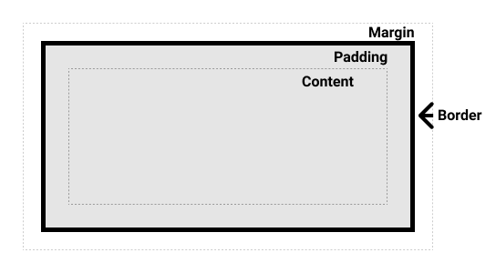

# Layout과 Containing Block

element의 크기와 위치는 그 element의 containing block에 의해 결정됩니다.  
일반적으로 containing block은 그 element의 가장 가까운 __block-level__ 부모의 __content area__ 이지만, 꼭 그렇지 만은 않습니다.



## Containing Block의 효과

Containing Block이 어떻게 설정되는지 알아보기 전에, 왜 Containing Block이 중요한지 알아봅시다.

__element의 크기와 위치는 그 element의 containing block에 의해 결정됩니다.__  

- `width`, `height`, `padding`, `margin` 에 적용되는 Percentage (%) 값
- __absolutely positioned__ element의 (position: absolute, fixed) offset 값

둘다 element의 Containing Block으로부터 연산됩니다.

## Containing Block은 어떻게 결정되나요

__element의 Containing Block을 파악하는 과정은 element의 position 값으로 부터 결정됩니다.__

- 만약 포지션 값이 `static`, `relative`, `sticky` (document 정상 플로우 position들) 라면, Containing Block은 이하 조건에 만족하는 가장 가까운 부모의 __content box__ 가 됩니다.
  1. 부모가 block container 이던가 (ex: block, inline-block, list-item element)
  2. 부모가 __formatting context__ 를 만들던가 (ex: table container, flex container, grid container, 또는 block-container)__(inline formatting context도 적용되는지 확인필요)__
- 만약 포지션 값이 `absolute` 라면, Containing Block은 포지션이 `static`이 아닌 (positioned) 가장 가까운 부모의 __padding box__ 가 됩니다.
- 만약 포지션 값이 `fixed` 라면, Containing Block은 viewport (__continuous media__ 인 경우) 로부터 결정이 되거나 page area (__paged media__ 인 경우) 로부터 결정이 됩니다.
- 만약 포지션 값이 `absolute` 또는 `fixed` 라면, Containing Block은 이하 조건에 만족하는 가장 가까운 부모의 __padding box__ 가 됩니다.
  1. `transform` 또는 `perspective` 값이 `none`이 아닌 경우
  2. `will-change: transform` 또는 `will-change: perspective`
  3. `filter` 값이 `none`이 아닌 경우 또는 `will-change: filter` (Firefox 에서만)
  4. `contain: paint`

> 노트: root element (`html`)를 포함하는 containing block은 __initial containing block__ 이라는 직사각형입니다. 그것의 치수는 viewport 이거나 (continuous media 일때) the page area 입니다 (paged media 일때).

## Containing Block으로부터 퍼센테지 값 계산하기

위에서 말했듯이, 특정한 프라퍼티가 퍼센테지 값을 받은 경우, __computed value__ 는 element의 containing block에 의해 결정됩니다. 이렇게 동작하는 프라퍼티는 __box model property__ 와 __offset property__ 입니다.

1. `height`, `top`, `bottom` 프라퍼티들은 containing block의 `height`을 토대로 계산이 됩니다.
2. `width`, `left`, `right`, `padding`, `margin` 프라퍼티들은 containing block의 `width`를 토대로 계산이 됩니다. (`padding`, `margin`이 `width`로 부터 계산되는게 인상적이네요)

## 예제

```html
<body>
  <section>
    <p>This is a paragraph!</p>
  </section>
</body>
```

html은 위로 고정이고 css만 바꾼다고 했을때

### Example 1

```css
body {
  background: beige;
}

section {
  display: block;
  width: 400px;
  height: 160px;
  background: lightgray;
}

p {
  width: 50%;   /* == 400px * .5 = 200px */
  height: 25%;  /* == 160px * .25 = 40px */
  margin: 5%;   /* == 400px * .05 = 20px */
  padding: 5%;  /* == 400px * .05 = 20px */
  background: cyan;
}
```

위에서 `<p>`는 position이 default로 static이기 때문에 containing block은 가장 가까운 block container인 `<section>` 이 됩니다.

### Example 2

```css
body {
  background: beige;
}

section {
  display: inline;
  background: lightgray;
}

p {
  width: 50%;     /* == half the body's width */
  height: 200px;  /* Note: a percentage would be 0 */
  background: cyan;
}
```

위에서 `<p>`는 position이 default로 static입니다. 하지만 `<section>` 이 `inline`이기 때문에 containing block은 `<body>`가 됩니다. (`<body>`의 default display는 `block`)

[https://html.spec.whatwg.org/multipage/rendering.html#the-page](https://html.spec.whatwg.org/multipage/rendering.html#the-page)

### Example 3

```css
body {
  background: beige;
}

section {
  position: absolute;
  left: 30px;
  top: 30px;
  width: 400px;
  height: 160px;
  padding: 30px 20px;
  background: lightgray;
}

p {
  position: absolute;
  width: 50%;   /* == (400px + 20px + 20px) * .5 = 220px */
  height: 25%;  /* == (160px + 30px + 30px) * .25 = 55px */
  margin: 5%;   /* == (400px + 20px + 20px) * .05 = 22px */
  padding: 5%;  /* == (400px + 20px + 20px) * .05 = 22px */
  background: cyan;
}
```

`<p>`의 포지션은 `absolute` 이기 때문에 가장 가까운 static position이 아닌 부모, 즉 `<section>`이 containing block 입니다.  
`<p>`의 퍼센테지 값들은 containing block의 padding에 의해 영향을 받습니다.  
__만약 `box-sizing: border-box` 였다면 영향을 받지 않았을 것입니다.__ (width가 padding을 포함해 400px)

### Example 4

```css
body {
  background: beige;
}

section {
  width: 400px;
  height: 480px;
  margin: 30px;
  padding: 15px;
  background: lightgray;
}

p {
  position: fixed;
  width: 50%;   /* == (50vw - (width of vertical scrollbar)) */
  height: 50%;  /* == (50vh - (height of horizontal scrollbar)) */
  margin: 5%;   /* == (5vw - (width of vertical scrollbar)) */
  padding: 5%;  /* == (5vw - (width of vertical scrollbar)) */
  background: cyan;
}
```

위의 경우 `<p>`가 `fixed` 이기 때문에 containing block은 initial containing block인 `viewport` 입니다. 그럼으로 `<p>`의 치수는 브라우저 창의 크기에 영향을 받습니다.

### Example 5

```css
body {
  background: beige;
}

section {
  transform: rotate(0deg);
  width: 400px;
  height: 160px;
  background: lightgray;
}

p {
  position: absolute;
  left: 80px;
  top: 30px;
  width: 50%;   /* == 200px */
  height: 25%;  /* == 40px */
  margin: 5%;   /* == 20px */
  padding: 5%;  /* == 20px */
  background: cyan;
}
```

위의 경우 `<p>`가 `absolute` 이고 `<section>`의 `transform` 값이 `none`이 아니기 때문에 `<section>`이 containing block이 됩니다.

[돌아가기](/README.md)
