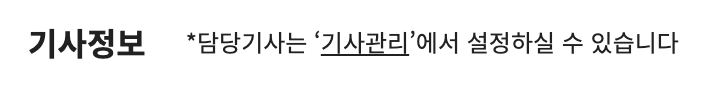
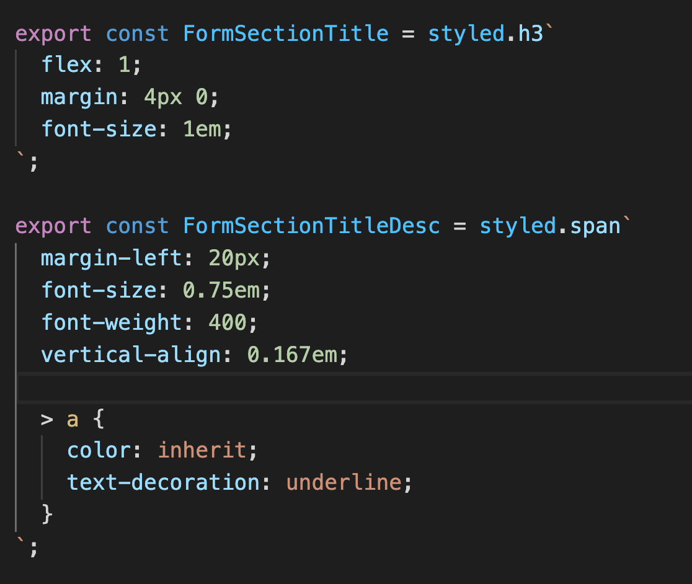
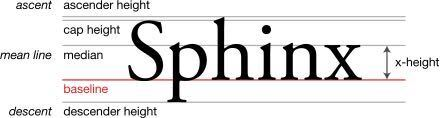

# vertical-align 과 baseline



우측에 있는 작은 글씨를 세로 가운데로 정렬을 하려고 했다.
언제나 그렇듯이 flex-box를 사용해서 처리를 했는데,
내가 아는 그분은 이런 식으로 코드를 짜셨더라.



왜 이게 동작하는지 잘 이해가 되지 않아서 분석을 좀 해보았다.

## em

> em : Relative to the font-size of the element (2em means 2 times the size of
> the current font)

기본이 16px인 텍스트를 0.75em를 적용해 타겟인 12px을 만들었다.

## vertical-align

> vertical-align : The vertical-align CSS property sets vertical alignment of an
> inline, inline-block or table-cell box.

vertical-align은 두가지 상황에서 사용이 가능하다고 한다.

1. Line box 안에 있는 inline element를 조작할때.
2. Table cell 안의 컨텐츠들을 조작할때.

> Note that vertical-align only applies to inline, inline-block and table-cell
> elements: you can't use it to vertically align block-level elements.

[vertical-align의 값은 여러 타입이 될 수 있고 작동 로직이 경우마다 다르다.](https://developer.mozilla.org/en-US/docs/Web/CSS/vertical-align)

그분이가 사용한 코드에서는

```css
 {
  vertical-align: 0.167em;
}
```

이 사용되었다.
이런 경우에는

> Aligns the baseline of the element to the given length above the baseline of
> its parent. A negative value is allowed.

이 법칙을 따르는데.

나는 왜 2px(12px의 0.167em) 을 사용했는지 이해가 가지 않았다.

## baseline

부모의 height가 24px이고
해당 엘레먼트의 height가 18px이기 때문에
24px - 18px = 3px 을 적용해야 하는거 아닌가? 라고 생각했다.



하지만 vertical-align은 base-line이라는 개념을 사용하고  
이것은 엘레먼트의 height 와는 별개이기 때문에 vertical-align: 3px을 하면 가운데 이상으로 글이 올라간다.  
vertical-align: length; 는 큰 글씨와 작은 글씨가 baseline을 공유하게 하기 때문에  
(font-size: )16px - (font-size: )12px/ 2 = 2px 을 올리면 작은 글씨가 큰 글씨 정가운데로 정렬이 형태였던 것이다.

[vertical-align을 잘 정리해놓은 글](https://christopheraue.net/design/vertical-align)

덕분에 inline element에 대해서 좀 더 이해할 수 있었다.

[돌아가기](../../README.md)
