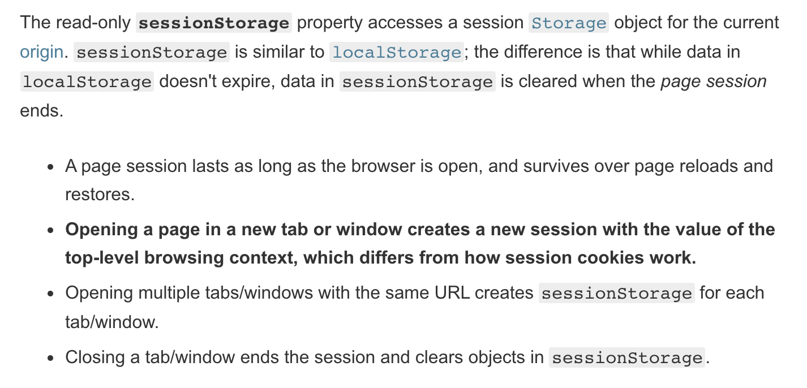
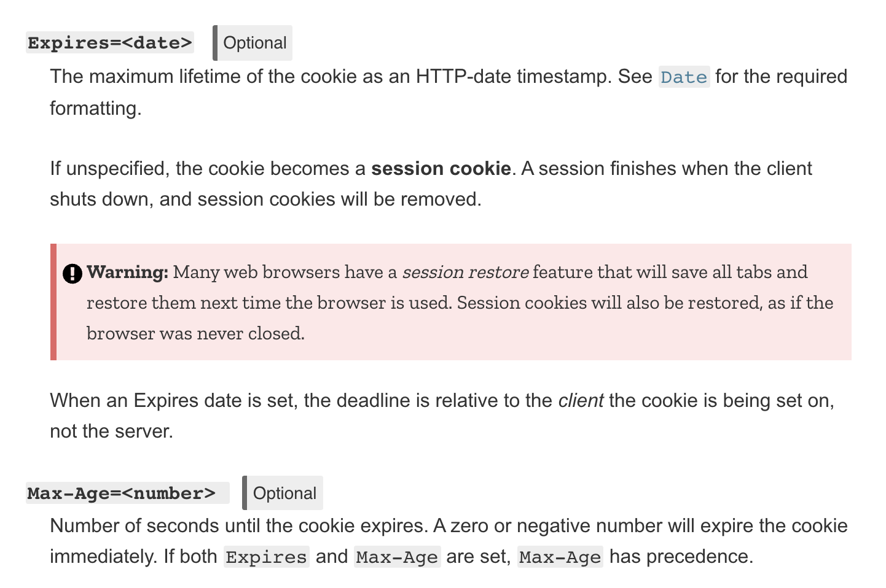
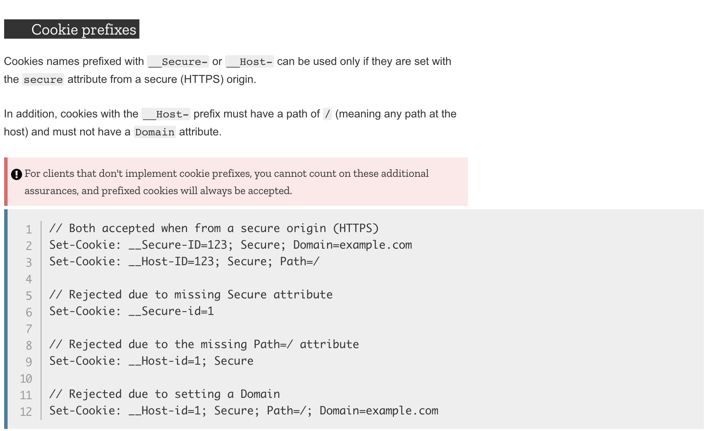

# Cookies

쿠키에 관해 정확히 모르는 부분이 있어 조사를 해 보았다.

[https://developer.mozilla.org/en-US/docs/Web/HTTP/Cookies](https://developer.mozilla.org/en-US/docs/Web/HTTP/Cookies)

- 서버가 브라우저에게 주는 데이터
- 브라우저는 이 데이터를 저장해두었다가 추후에 같은 서버에 요청을 할때 쿠키 데이터를 같이 보낼 수 있다.

보통 아래의 이유로 많이 쓰인다

1. 세션 관리: 로그인, 장바구니, 게임 점수 등 서버가 기억해야할 데이터
2. Personalization: 테마 등 사용자 설정
3. Tracking: 사용자 행동 기록, 분석

- 예전에는 대안이 없을때에는 쿠키를 클라이언트 데이터 저장용으로 많이 썻는데 이제는 Modern Storage Api를 사용한다.
  (Web Storage Api: localStorage, sessionStorage / indexedDB)
- 쿠키는 매 request 마다 보내지기 때문에 performance에 타격이 있을 수 있다. (특히 모바일)

## 쿠키 생성

- 서버에서 Set-Cookie 헤더 적용이 적용되어 있는 response로 쿠키 설정
- 브라우저에서 저장해두었다가 Cookie 헤더를 통해 동일 서버에 전송

## 유통기한

- session cookies
- Permanent cookies

두 가지 종류가 있는데 session cookies는 브라우저 세션이 종료되면 사라진다고 한다.
브라우저 세션과 서버에서 관리하는 세션이 헷갈렸는데. MDN sessionStorage 페이지에서 정보를 좀 얻을 수 있었다.

언제 session이 되고 언제 permanent가 되는지 (Max-Age 속성이 설정되어도 permanent가 된다고 합니다.)

내 사이트가 사용자 인증 (authentication)을 한다면, 인증 할때마다 새로 session cookie를 발급해 주라고 하는데
sessio fixation 공격으로 부터 방어력을 높이기 위해 그러라고 한다.

## Access Restriction

중요한 Set-Cookie attribute

- Secure: https 요청일 경우에만 쿠키를 서버로 보낸다. http:// 사이트의 경우 Secure attribute 사용불가 (Man in the Middle 공격 방어)
- HttpOnly: Docment.cookie api로 자바스크립트 접근 불가 (Cross Site Scripting 공격 방어)

## 쿠키는 어디로 가는가

> The Domain and Path attributes define the scope of the cookie: what URLs the cookies should be sent to.

### Domain

- 설정 안될 경우 쿠키를 세팅한 origin으로 자동 설정. subdomain 제외
- 설정이 될 경우 subdomain 포함

> For example, if Domain=mozilla.org is set, then cookies are available on subdomains like developer.mozilla.org.

### Path

- 경로가 포함된 곳에만 쿠키 전달
- Path=/docs 일 경우
  - /docs
  - /docs/Web
  - /docs/Web/HTTP

에 다 전달됨

### SameSite

cross origin request 일 경우 제한을 줌 (cross-site request forgery attack 방어: CSRF)

- Strict: Set-Cookie를 한 사이트가 요청을 할 때에만 해당 쿠키를 보내줌
- Lax: cross-site subrequest (calls to load image or frame)에는 쿠키 설정이 되지 않으나,  
  외부 사이트에서 링크를 통해 Set-Cookie를 한 사이트로 가능 경우 쿠킬 설정이 됨
- 응 딴데서 요청 들어와도 되어

> 브라우저들이 SameSite=Lax default 로 가는 추세라고 한다.

### Cookie prefixes(접두어)

session fixation, CSRF 등의 공격으로 부터 방어하기 위해 이런 접두사들을 사용한다

- \_\_Host-
  - Secure 속성이 있어야만 Set-Cookies가 적용됨, secure한 origin으로부터인지 확인함
  - Domain 속성이 설정되면 안됨, Path=/ 으로 설정되어야 함
- \_\_Secure-
  - Secure 속성이 있어야만 Set-Cookies가 적용됨, secure한 origin으로부터인지 확인함

### Document.cookies

- 를 통해 새로운 쿠키를 생성할수 있고, 기존의 쿠키에 접근할 수 있음 (HttpOnly가 없다면)
- Document.cookies를 통해 만들어진 쿠키는 HttpOnly 설정이 안됨

## 보안

> 모든 쿠키의 값은 사용자가 보고 수정할 수 있다는 것을 염두에 두고 쿠키를 사용해야 한다.
> 서버에게만 의미가 있는 opaque identifier를 사용하거나
> JSON Web Token 같은 다른 인증 시스템을 사용하는 방법도 있다.

방어 팁

- HttpOnly를 사용할것
- 민감한 정보를 가지고 있는 쿠키의 유통기한은 짧아야 한다.
- SameSite는 Strict나 Lax를 사용할 것. 다른 사이트에서 request를 할 시에 authentication 같이 민감한 쿠키를 설정하지 않게 함.

## 트랙킹과 프라이버시

### third-party cookies

- 쿠키의 도메인이 지금 당신이 있는 사이트 같다면 first-party cookies
- 아니라면 third-party cookies
- 당신이 있는 사이트에 들어가는 광고 배너 같은 것들이 third-party cookies를 추가할 수 있다. 이걸 통해 사용자의 행동패턴을 읽는다. 파이어폭스는 기본적으로 트랙킹을 하는 third-part cookeis를 차단함.

### 쿠키 관련 regulation

쿠키관련해서 EU나 캘리포니아에서 해당 지역에 사람들이 접근하는 어떤 사이트든

- Notifying users that your site uses cookies.
- Allowing users to opt out of receiving some or all cookies.
- Allowing users to use the bulk of your service without receiving cookies.

요런 룰을 따라야 한다는 규약들이 있다고 한다. 그래서 어떤 사이트 가면 쿠키 허용할건지 물어보는듯.

[돌아가기](/README.md)
