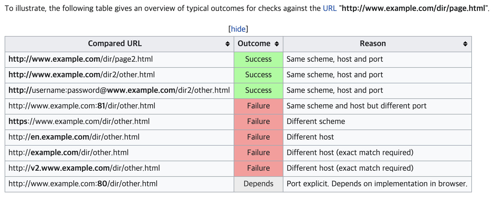
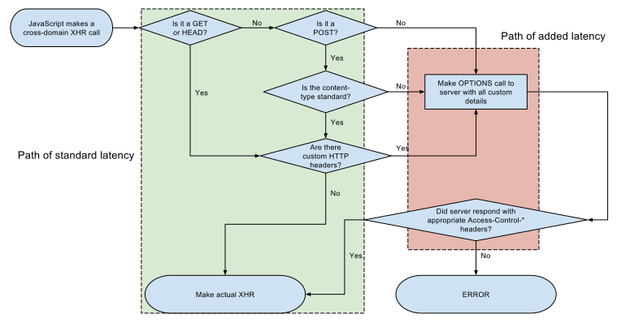

# CORS

최근에 CORS 관련 문제가 생겼는데 확실히 몰라서 이 주제에 관련해서 조사를 하고 큰 부분만 정리를 해보았다.

## same-orign policy

[https://developer.mozilla.org/en-US/docs/Web/Security/Same-origin_policy](https://developer.mozilla.org/en-US/docs/Web/Security/Same-origin_policy)

우선 Same Origin 이 아니면 Cross Origin으로 정의되는데  
Same Origin은 세가지가 같아야 한다.

- protocol (ex: https)
- host (ex: developer.mozilla.org)
- port (ex: ":81", 명시되지 않았다면 default는 포트 80으로 처리됨)

나는 superdomain 과 subdomain 관련 어떤 제한을 풀어주는 규칙이 있는걸 들어서 혹시 CORS 에 적용이 되나 싶었는데  
해당 내용은 cookie에 적용 되는 도메인 룰이었던 걸 확인했다.  
즉 origin에 대해선 developer.mozilla.org !== mozilla.org

> 하지만 document.domain을 조작해서 상위 도메인의 origin으로 바꿀 수 있다고 한다.

## cross origin resource sharing

[https://developer.mozilla.org/en-US/docs/Web/HTTP/CORS](https://developer.mozilla.org/en-US/docs/Web/HTTP/CORS)

> For Ajax and HTTP request methods that can modify data (usually HTTP methods other than GET, or for POST usage with certain MIME types), the specification mandates that browsers "preflight" the request, soliciting supported methods from the server with an HTTP OPTIONS request method, and then, upon "approval" from the server, sending the actual request with the actual HTTP request method. Servers can also notify clients whether "credentials" (including Cookies and HTTP Authentication data) should be sent with requests.

> 정보를 수정할수 있는 Ajax나 Http 요청에 대해서  
> (!(GET || HEAD || 특정 MIME type의 POST)의 HTTP 요청)
> 스펙은 브라우저가 서버에게 허락한 메서드를 확인받는 preflight request를 보낸다. (method: OPTION)
> 서버의 확인이 있은후에야 실제 요청을 보낸다.
> 서버는 클라이언트에게 credentials (Cookie나 HTTP Authentication 데이터)를 같이 보내는게 허가되는지 정할 수 있다.
> (Access-Control-Allow-Credentials)

> CORS 관련 헤더는(서버, 클라이언트) 일반적으로 Access-Control-\* 의 패턴을 사용하는 것 같다.
