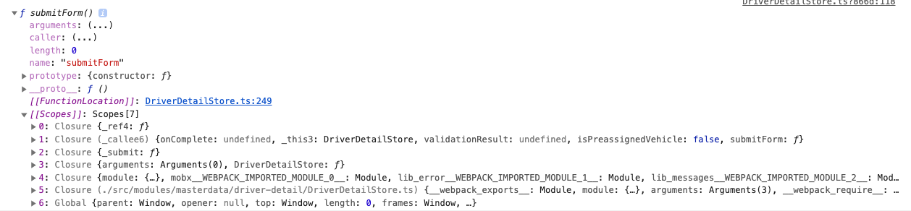

# closure & console.dir(obj)

클로저에 관해서 조사를 하던중

[https://www.freecodecamp.org/news/javascript-closure-tutorial-with-js-closure-example-code/](https://www.freecodecamp.org/news/javascript-closure-tutorial-with-js-closure-example-code/)

console.dir 라는 함수를 사용해서 scope 확인을 하더라

각 레이어 별로 클로저를 표현해주는 것을 볼 수 있다.

[https://developer.mozilla.org/en-US/docs/Web/API/Console/dir](https://developer.mozilla.org/en-US/docs/Web/API/Console/dir)

> "The Console method dir() displays an interactive list of the properties of
> the specified JavaScript object. The >output is presented as a hierarchical
> listing with disclosure triangles that let you see the contents of child >objects.
>
> In other words, console.dir() is the way to see all the properties of a
> specified JavaScript object in console by >which the developer can easily get
> the properties of the object."

mdn을 보니 Console에 이 이외에도

- profile, profileEnd
- trace

등 내가 모르는데 쓸만해 보이는 함수들이 많이 있었다.

[돌아가기](../../README.md)
