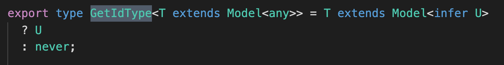
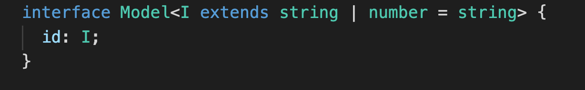
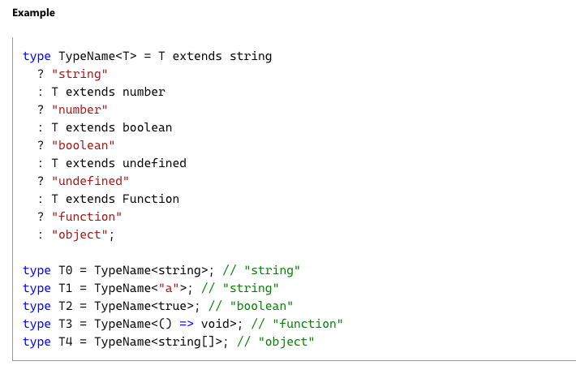

# GetIdType (Conditional, infer, never)

이 코드가 이해가 안되어서 분석을 해보고 싶었다.

우선 Condtional Types가 되는지 처음 알았다.

- type이 extends 하는지 여부에 따라 타입을 정할수 있는 conditional
- infer 을 사용해서 conditional 내에 타입 변수를 사용할 수 있다.  
  [https://stackoverflow.com/questions/60067100/why-is-the-infer-keyword-needed-in-typescript](https://stackoverflow.com/questions/60067100/why-is-the-infer-keyword-needed-in-typescript)

위 코드를 다시 해석해 보자
Model 인터페이스를 상속하는 타입 T를 GetIdType에 넣으면
conditional 타이핑을 통해 T가 `Model<infer U>`를 상속하는지 확인하고
true면 U를 타입으로
false라면 never을 타입으로 정한다.

[https://blog.logrocket.com/when-to-use-never-and-unknown-in-typescript-5e4d6c5799ad/](https://blog.logrocket.com/when-to-use-never-and-unknown-in-typescript-5e4d6c5799ad/)

이 글을 보면 never의 개념과 언제 사용되는지를 잘 정리해 놓았는데
GetIdType 처럼 사용해 만약 들어온 제네릭이 Model 형태가 아닐 경우 never로 타입 체킹을 할 수 있다.
그리고 모델이 받는 제네릭을 `infer U` 로 타입 변수로 뽑아내
실제 모델 내의 Id 타입을 GetIdType을 통해 가져올 수 있는 것이다.

[돌아가기](/README.md)
