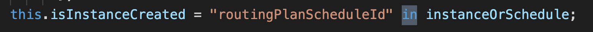

# in & hasOwnProperty



## in

in 이라는 키워드가 사용되는걸 처음 봐서 조사를 해 보았다.  
[https://developer.mozilla.org/en-US/docs/Web/JavaScript/Reference/Operators/in](https://developer.mozilla.org/en-US/docs/Web/JavaScript/Reference/Operators/in)

- Object나 Array에 property나 index 유무를 체크하는데 사용한다.
- Object 내에 property 체크시에는 string을 사용. prototype 체인에 있는 property도 체크에 포함된다.

```js
"name" in { name: "Randy Marsh" }; // true
"toString" in { name: "Randy Marsh" }; // true
```

- Array 내 index 체크시에는 number을 사용. Empty 개념을 체크 하기 때문에 좀 특이하게 작동한다.

```js
5 in new Array(3).fill("nice"); // false
2 in new Array(3).fill(undefined); // true
2 in new Array(3); // false
```

## hasOwnProperty

프라퍼티 체크를 하는 이 함수가 기억이 나서 차이점을 찾아보았다.

[https://masteringjs.io/tutorials/fundamentals/hasownproperty](https://masteringjs.io/tutorials/fundamentals/hasownproperty);

- hasOwnProperty는 prototype inheritance로 생긴 property는 체크하지 않는다
- hasOwnProperty는 ES6 getter, setter 는 체크하지 않는다.

[https://eslint.org/docs/rules/no-prototype-builtins](https://eslint.org/docs/rules/no-prototype-builtins)

- 위에 이유때문에 eslint는 아래 형식으로 사용하는걸 권장한다.

```js
Object.prototype.hasOwnProperty.call(foo, "bar");
```

[돌아가기](../../README.md)
