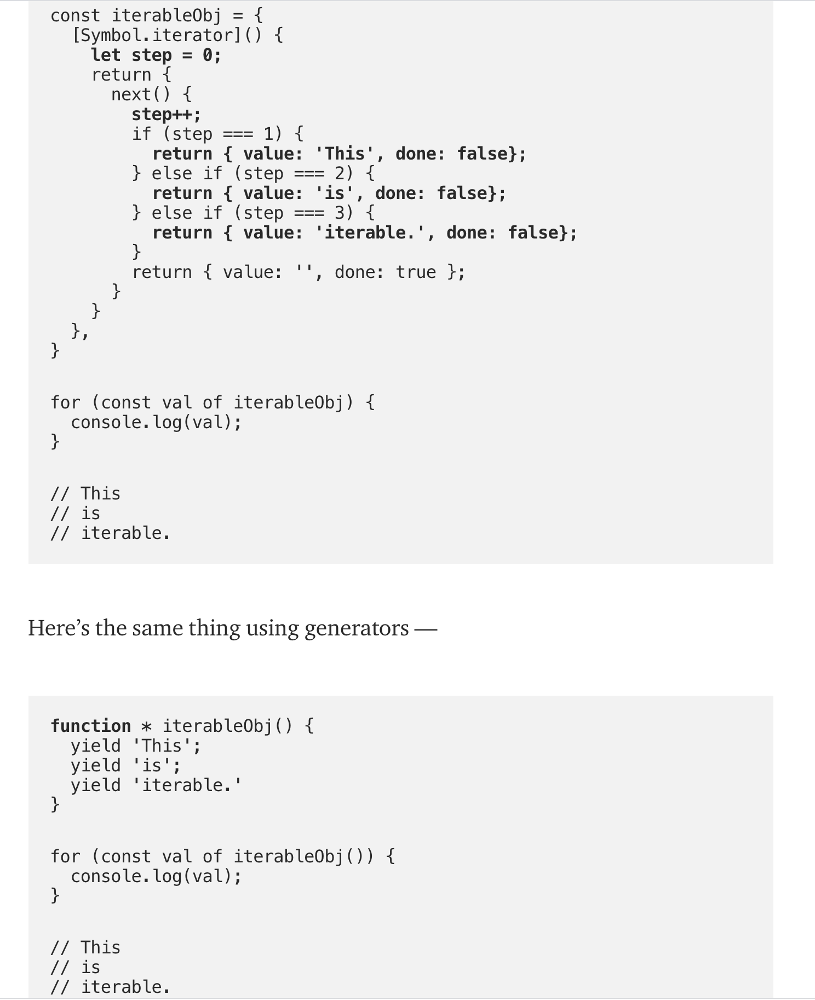

# Iterator 와 Generator

[https://codeburst.io/a-simple-guide-to-es6-iterators-in-javascript-with-examples-189d052c3d8e](https://codeburst.io/a-simple-guide-to-es6-iterators-in-javascript-with-examples-189d052c3d8e)

[https://codeburst.io/understanding-generators-in-es6-javascript-with-examples-6728834016d5](https://codeburst.io/understanding-generators-in-es6-javascript-with-examples-6728834016d5)

Generator 함수는 예전에 redux-saga 를 사용하면서 접해봤지만, 사실 왜 쓰이는지 어떻게 동작하는지 정확하게 알지 못해서 이번에 한번 조사를 해 보았다.

Generator를 알려고 하니 Iterator 부터 먼저 알고 오라고 해서

> Generators are intricately linked with iterators. If you don’t know about iterators, here is an article to better your understanding of them.

여기서 Iterator 에 대해서 정리를 해보고 Generator 와 연결시켜 이해해 보려고 한다.

## Iterator가 뭐고 왜 Iterator를 사용하나요?

제가 가암히 요악을 해보자면,

**Iterator의 장점은 컬렉션 데이터를 일관적으로 읽을 수 있도록 인터페이스를 제공해준다는 것 입니다.**

"Iterable" 한 객체는 [Symbol.iterator]라는 팩토리 함수를 가지고 있고, 이 함수는 iterator 객체를 생성합니다.

iterator 객체는 next 라는 함수를 가지고 있고 이 함수를 실행 시키면

```ts
interface IteratorReturnValue {
  value: any;
  done: boolean;
}
```

위 형태의 값을 돌려줍니다.


글 작성자가 커스텀하게 만든 iterable 객체

일단 Iterable 형태로 만들어 놓으면 내부 구조가 어떻게 되어 있든 사용자는 iterator의 next 함수를 통해 안정적으로 값에 접근할 수 있습니다.

Javascript Iterable 개념이 사용되는 곳:

- Array
- Strings
- Maps
- Sets
- arguments
- for-of 루프
- Destructing of Array
- spread (...)


Array destructring이 내부적으로 iterator를 어떻게 사용하는지

## Generator가 뭐고 왜 Generator를 사용하나요?

> generator is a function that can stop midway and then continue from where it stopped.

"중간에 멈추었다가 다시 그곳부터 시작할수 있는 함수" 라고 합니다.

> A generator is a function that produces a sequence of results instead of a single value, i.e you generate ​a series of values.

"일반함수 처럼 하나의 값(return value)이 아닌 여러 개의 값을 만들어내는 함수" 라고 합니다.

> Generators are a special class of functions that simplify the task of writing iterators.

"Iterator를 만들기 쉽게 해주는 특수한 함수" 라고 합니다.

마지막 정의가 뭔가 의미심장하네요. 작가님이 설명해주신걸 풀어보겠습니다.


generator 함수를 실행시켜서 돌려주는 return 값은 바로 Iterator 입니다.

위의 코드를 보시면 generatorFunction()을 실행시켜서 돌려받은 generatorObject에 next 함수가 있고 그 함수를 실행시키면 {value: any} 가 나오는걸 볼수 있습니다.

위의 Iterator의 구조에서 본것과 같네요.


제너레이터 함수의 흐름

generatorObject를 next나 for-of 를 사용해 돌리기 시작하면

generator 함수 내에 yield 가 적혀있는 곳까지 실행이 되고 yield 오른쪽 값을 돌려주며 함수가 멈춥니다.

이 흐름을 반복하며 함수내 코드를 사용합니다.

저는 이런식으로 생각했습니다.

```js
[
    () => {yield 1},
    () => {yield 2},
    () => {yield 3},
    () => {yield 4},
]
```

우리는 일반적으로 스트링, 숫자, 오브젝트 같은 '값'을 Collection 의 value 로 사용하지만 Generator는
yield로 나눠지는 코드 블럭들이 컬렉션의 멤버인듯한 느낌입니다.

Generator를 통해 나오는 value 값은 yield의 값이기 때문에 좀 개념이 다르기는 하지만 next를 할때 yield 로 나눠지는 코드가 실행이 되기 때문에 위처럼 생각하면 좀 제너레이터 함수 흐름이 좀 직관적으로 이해할수 있다고 생각했습니다.



위의 예제를 보면 위해 고생을 해서 만들어 놓은 iterable을 generator로 간단하게 만든 것을 볼수 있습니다.

Iterator와 Generator를 함께 보니 이해가 조금더 잘 된 느낌입니다아

GOOD

[돌아가기](/README.md)
