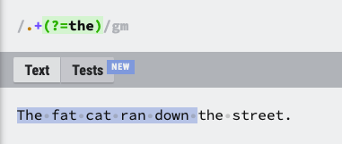
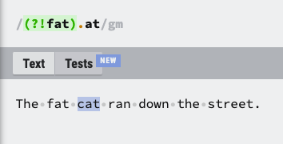

# regex 이해하기

우선 간단한 string 작업의 경우 코드로 string을 manipulate 하는게 regex로 하는것 보다 빠르다고 한다.

[https://stackoverflow.com/questions/16638637/whats-faster-regex-or-string-operations](https://stackoverflow.com/questions/16638637/whats-faster-regex-or-string-operations)

하지만 pattern이 복잡해질수록 거기에 상응하는 string manipulation code를 짜기가 힘들어지고,

regex는 복잡한 문제를 꽤나 간단하게 처리할수 있기 때문에 자주 사용한다고 한다.

[https://www.youtube.com/watch?v=rhzKDrUiJVk](./https://www.youtube.com/watch?v=rhzKDrUiJVk)

위 영상을 참고해 기본 개념을 배웠다.
아래 링크로 regex 테스트.

[https://regexr.com/](https://regexr.com/)

## Flag

- 우리가 보통 디렉토리 path를 쓸때 사용하는 "forward-slash(/)" 로 패턴을 감싼다
- 마지막에 붙는 flag로 옵션을 선택할수 있음
  - g: 없으면 첫번째 match만 찾아내지만 (Array.prototype.find 같이), 붙으면 string 내 match 되는 모든 부분들을 찾아낸다.
  - i: case insensitive, 붙으면 대문자 소문자 관계없이 match 함. (ex: /why/gi 같이 원하는 플래그를 그냥 뒤에 계속 붙이면 된다)
  - m: 텍스트를 하나로 보지 않고 newline 마다 `^` 또는 `$` 체크
- 이 외에도 더 있지만 많이 사용하지 않기 때문에 생략

## Character Class

- `/w`: 모든 문자들, `/W` 대문자일 경우 모든 문자가 아닌것들 (! 같이)
- `/s`: 모든 공백들, `/S` 대문자일 경우 모든 공백이 아닌것들 (! 같이)
- `.`: wild card, 어떤 char이든 다 match 함 (newline 빼고)
- [abc]: a나 b나 c
- [^abc]:`!(a나 b나 c)`, a b c 가 아닌 것들 match
- [a-g]: a와 g 사이 문자들 (ex: `[a-zA-Z]` 이렇게 붙여서도 사용됨)

## Quantifiers & Alterantion

- `+`: 앞에 있는 토큰을 연속되는 만큼 match 한다
- `?`: optional, 있으면 match하나 없으면 없이 match 함
- `*`: optional + 연속, 0 ~ n 까지 match 함 (위 두개가 합친거라고 생각하면 됨)
- `{n}`: n개만 match
- `{n,}`: n 이상 match (, 뒤에 공백 들어가면 해당 패턴을 문자들로 인식함)
- `{n,m}`: n 이상 m 이하 match (큰 숫자를 우선시한다. 3개 match 할 수 있는데 1개 match 하지 않는다는 말)
- `a+?`, `a{2,}?`: 최소한으로 match (가능하다면 1개), 2 이상 최소한으로 match
- `a|b`: a 또는 b, `(t|T)he` 이런식으로 사용할수 있음 (the | The), `t|The` 이렇게 사용하면 (t | The) 이렇게 match 되게 때문에 그룹으로 만들어야 함.

## Escaped Characters

- `/`: 기호 escape (ex: `\.` period match)

## Grouping

- g 플래그를 끄고 match를 하면 배열을 돌려주는데 그룹된 것들은 따로 match가 나온다.

  ```js
    let str = '<h1>Hello, world!</h1>';

    let tag = str.match(/<(.*?)>/);

    alert( tag[0] ); // <h1>
    alert( tag[1] ); // h1
  ```

- 그룹 뒤에 quantifier을 붙이면, group 전체에 적용됨.
- 그룹 nesting도 가능.

## anchor

- `^`: 시작만 체크
- `$`: 끝만 체크
- (?=abc): 저 안에 있는 패턴의 위치를 찾아서 그곳에서부터 패턴을 체크한다.

  

- (?!abc): 위의 반대에서 패턴 체크

  

## 0을 포함한 자연수인지 체크하는 regex

```js
function isNormalInteger(str) {
    return /^\+?(0|[1-9]\d*)$/.test(str);
}
```


더 복잡한 상황이 많지만, 위 정도만 알아놔도 대부분의 하고 싶은 matching은 할 수 있다고 한다.
필요하면 더 추가하자.

[돌아가기](/README.md)
