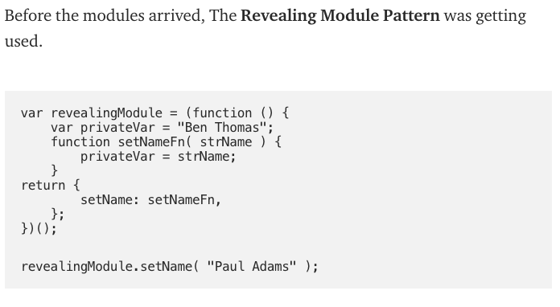

# require vs import

[https://medium.com/computed-comparisons/commonjs-vs-amd-vs-requirejs-vs-es6-modules-2e814b114a0b](https://medium.com/computed-comparisons/commonjs-vs-amd-vs-requirejs-vs-es6-modules-2e814b114a0b)

옛날에 자바스크립트에는 모듈화를 제대로 할 수 있는 방법이 없었음.

Revealing Module Pattern 같은 걸 사용해 처리했었는데



CommonJS 라는 라이브러리가 require exports 형태의 모듈 시스템을 제공함.

이게 좋아서 Node내에 모듈 시스템도 CommonJS require modules.exports 형태로 따라감.

CommonJS가 브라우저에서는 맞지 않는 부분이 있어서 AMD 라는 형태의 시스템도 만들어졌음.

```js
define(["module1", "module2"], function (module1, module2) {
  console.log(module1.setName());
});
```

이런식으로 다 라이브러리로 해결을 하다가 ES6에서 내장 모듈 시스템 import export에 대한 스펙이 나옴.

편하고 좋은데 아직 지원이 안되는 환경이 생각보다 많아서 Babel같은거로 transpile을 하거나 esm을 써야함.

[돌아가기](/README.md)
