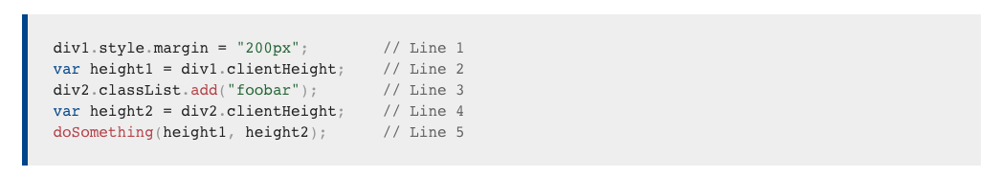

# runNonBlockingThread와 Event Loop


태건님이 작성하시고 TMS 내에서 사용중인 위 코드가 있다.

위 코드를 통해 JS의 이벤트 루프에 대해 많이 배울 수 있을 것 같아 분석을 해보려고 합니다.

## 버그

현재 이 코드는 기사, 차량 같은 entity를 추가하거나 수정할때 (submit) 사용되는데


보면 validation후 submitForm 함수를 통해 this.driver가 없으면 기사 추가, 있으면 기사 수정 함수를 부르는 것을 볼수 있다.

현재 이 코드를 runNonBlockingThread를 통해 불러주고 있는데

runNonBlockingThread 없이 submitForm을 사용한다면 submitEditForm이나 submitAddForm이 실행이 되지 않는 문제가 있었다.

해당 버그를 해결하기 위해 runNonBlockingThread를 추가한것.

해당 버그가 발생하는 이유는 submit에 붙어 있는 submitAction 데코레이터 때문인데


이 데코레이터는 서버에 데이터를 업데이트 하는 중 (async) 추가적인 submitAction이 발생하지 않도록 막아주는 역활을 한다.

> isSubmitting이 true 이면 return 해주는 걸 볼 수 있다.

debounce 와 어떻게 보면 비슷하다고 할 수도 있겠다.

문제는 해당 데코레이터가 submitEditForm이나 submitAddForm에도 붙어 있다는것


submit이 실행되기전 isSubmitting이 true 가 되기 때문에

submitEditForm 이 실행되기 전 submitAction의 코드 때문에 return 이 되어 버린다.

submit이나 submitEditForm 둘중 하나에만 사용한다면 해결되겠지만, 그러면 둘중 하나의 await 가 길어질 경우 추가적인 submit 방어를 하지 못하는 문제가 있다.

그렇다면 왜 runNonBlockingThread를 사용하면 이 문제가 해결이 될까.

## runNonBlockingThread는 어떻게 버그를 해결하는가


자바스크립트의 Event Loop이 돌아가는 것을 보면

Callstack 에 올라있는 코드가 완전히 실행이 된후에야

1. setTimeout으로 등록된 Message

2. Promise로 등록된 Job

3. 그리고 Style, Layout, Paint, Composite로 구성된 Render 프로세스가 돌아간다.

```js
setTimeout(() => {
  console.log("서");
});
console.log("민석");
```

위에 코드가 어떻게 찍히시는지는 아실테고

```js
document.body.appendChild(el);
el.style.display = "none";
```

위에 코드를 돌려도 el 이 등장했다 사라지는 걱정은 하지 않아도 된다. 이미 none 까지 적용이 된후 렌더 프로세스가 돌아갈 것이기 때문.

[https://medium.com/@francesco_rizzi/javascript-main-thread-dissected-43c85fce7e23](https://medium.com/@francesco_rizzi/javascript-main-thread-dissected-43c85fce7e23)

즉 runNonBlockingThread를 통해 submitEditForm을 실행하면

requestAnimationFrame과 setTimeout으로 인해

submit과 붙어있는 submitAction의 코드가 다 실행되고 난후


isSubmitting이 false 인 상태로 submitEditForm이 실행이 되기 때문에 return 되지 않고 해당 버그가 해결 되는것.

## runNonBlockingThread에 대한 분석

태건님의 runNonBlockingThread 함수 위에 달아 두신 링크를 따라가 보면

[https://developer.mozilla.org/en-US/docs/Mozilla/Firefox/Performance_best_practices_for_Firefox_fe_engineers
](https://developer.mozilla.org/en-US/docs/Mozilla/Firefox/Performance_best_practices_for_Firefox_fe_engineers)


runNonBlockingThread 코드를 찾을 수 있다.

해당 코드가 있는 섹션은

> How do I avoid triggering uniterruptible reflow?
> 어떻게 관여 불가능한 reflow를 피하는가?

즉 mdn 에서 이 코드를 uniterruptible reflow를 피하기 위한 대응책으로 설명하는데

우선 uninterruptible reflow가 뭔지 알아보자

### uninterruptible reflow

우선 내가 이해하기로 reflow란 자바스크립트로 일어난 스타일에 대한 변경이

Style > Layout > Paint > Composite

을 통해 화면에 반영되는 과정을 말한다.

자바스크립트 엔진에서 스타일 변화를 감지하고 자동으로 스타일을 화면에 적용해주는 reflow를 interruptible reflow 라고 하는데

문제는 이 reflow 과정이 일어나는 중 새롭게 스타일에 대한 코드 변경이 이루어질 경우이다.

일반적으로 이때 잘 풀린다면 Layout에 대한 연산이 스킵되고 새로은 스타일이 반영된 코드에 대한 Layout만 처리된다고 한다.
(일종의 쓸모없는 연산을 안하도록 하는 optimization 이라고 이해했다.)

> When an interruptible reflow is interrupted, the best-case scenario is that all layout is skipped, and the layout operation ends.

하지만 이런 기본적으로 일어나는 interruptible reflow와 반대로

uninterruptible reflow 라는 플로우가 있다.



위 코드에서 div1.clientHeight 접근할때와 같이 style 프러파티에 접근할 때 이 reflow가 발현되는데

만약 스타일 프라퍼티에 접근했을때 DOM 상 size 나 position 변화가 하나라도 있었다면

DOM은 스타일 프라퍼티에 대한 정확한 값을 주기 위해 강제로 모든 reflow 연산을 강제로 수행한다.

이 연산 자체의 cost가 높고, 한 프레임 안에 두번의 reflow 과정이 들어가는 등 여러 문제가 있기 때문에

> Uninterruptible reflow is what we want to avoid at all costs.

절대 피하라고 한다.

여기서 runNonBlockingThread의 코드가 효과가 있는데

```js
requestAnimationFrame(() => {
  setTimeout(() => {
    // This code will be run ASAP after Style and Layout information have
    // been calculated and the paint has occurred. Unless something else
    // has dirtied the DOM very early, querying for style and layout information
    // here should be cheap.
  }, 0);
});
```

> Style > Layout > Paint가 끝난 직후에 실행 되게 된다. 아주 짧은 순간에 스타일 변화가 일어나지 않았다면, 이 지점에서 스타일 프라퍼티에 접근하는 것은 Uninterruptible reflow 없이 연산량을 최소화 할수 있다.

> requestAnimationFrame > setTimeout > Rendering > setTimeout Callback

하지만 TMS 내에서 runNonBlockingThread가 사용되는 이유는 결국 submit 의 코드가 완전히 끝난후에 submitEditForm 을 실행시키기 위한 것이므로

requestAnimationFrame과 setTimeout 두개를 섞어서 사용할 필요 없이

둘중에 하나만 사용해도 해당 버그를 해결할 수 있다.

[돌아가기](../../README.md)
