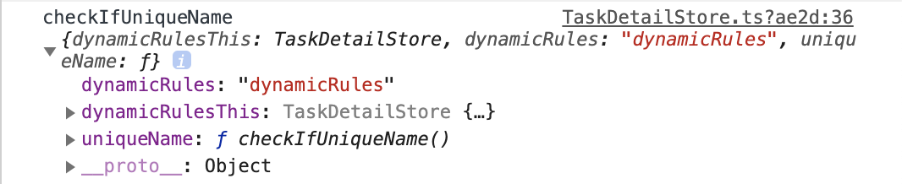

# this 이해하기

[https://medium.com/better-programming/understanding-the-this-keyword-in-javascript-cb76d4c7c5e8](https://medium.com/better-programming/understanding-the-this-keyword-in-javascript-cb76d4c7c5e8)

## TL;DR

1. 기본적으로 this는 global 오브젝트를 가르킨다. (strict-mode 일때는 undefined)

   - NodeJS - global
   - 브라우저 - window

2. 메서드가 오브젝트의 프라퍼티로 불린경우 this는 부모 오브젝트를 가르킨다. (ex: object.testFunc())

3. "new" 키워드로 함수가 불려서 인스턴스가 생성된 경우, 함수 내부 this는 새로 생성된 인스턴스를 가르킨다.

4. call, apply 로 함수가 불린경우, 두 함수의 첫번째 인자가 this로 설정된다.

5. Arrow Function 내부에 this는 함수 밖에 this를 그대로 사용한다.

## 문제

개발을 하다 this가 틀려서 오류가 생기는 경우가 있었다.

TaskDetailStore 라는 인스턴스 내에

이런 코드가 있었는데

checkIfUniqueName 함수 내에 this.taskService.getCompactTasksByName()가 동작이 되려면
this가 TaskDetailStore로 설정이 되어야 하는데, this가 dynamicRules 오브젝트로 설정이 되서 오류가 생겼다.

## 발생원인

나는 dynmamicRules 오브젝트 내에 this가 "자신" 즉 dynmaicRules 오브젝트로 잡혀서

오브젝트 속의 프라퍼티인 this.checkIfUniqueName에도 영향을 미치는 줄 알았는데

막상 dynamicRulesThis를 콘솔로 찍어서 확인을 해보니

dynamicRules 오브젝트 내에 this는 TaskDetailStore인것을 확인할 수 있었다. (단순 오브젝트를 만들었다고 context의 this가 바뀌지 않는다. context 기본 this를 바꾸려면 new 로 instance를 생성해주어야 함.)

그러면 왜 문제가 생겼는지 생각해보니

cake-form 내에서 dynamicRules를 실행시킬때

- dynamicRules[ruleKey](x, form) 이렇게 실행이 되기 때문에

> When a method is called as a property of an object, then this refers to the parent object

위의 조건에 적용이 된다.

즉 dynamicRules 오브젝트의 프라퍼티로 this.checkIfUniqueName 함수가 불려서 this가 dynamicRules 오브젝트로 잡혔었던 것 같다.

이렇게 arrow 함수로 감싸준다면 오브젝트의 프라퍼티로 함수를 사용해도

context의 this가 저장되고 변하지 않기 때문에 TaskDetailStore가 제대로 this로 잡히는것으로 이해했다.

[https://stackoverflow.com/questions/33308121/can-you-bind-this-in-an-arrow-function](https://stackoverflow.com/questions/33308121/can-you-bind-this-in-an-arrow-function)

- 위 스택오버플로우를 보면 명확히 arrow 함수는 this rebind 가 되지 않는다고 나와있다.

앞으로도 this를 사용할때 어떻게 동작할지 생각을 해보고 실제 행동을 보면서 익히다 보면 this 에 대해 더 확실히 파악할 수 있을 것 같다.

[돌아가기](/README.md)
