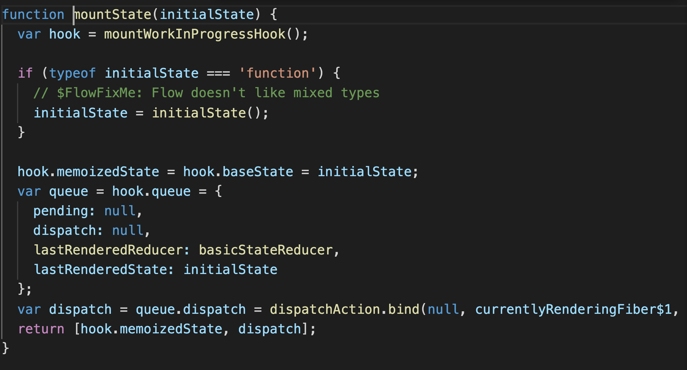

# useState - lazy initial State, functional updates

[https://reactjs.org/docs/hooks-reference.html#usestate](https://reactjs.org/docs/hooks-reference.html#usestate)

## lazy initial state

```jsx
const [state, setState] = useState(() => {
  return something;
});
```

팀의 코드 베이스를 보다 보면 종종 useState 내에 위처럼 함수를 useState의 인자로 넣어주는 경우가 있다.
React의 문서에서는 이 syntax를 lazy initial state 라고 하는데,
이렇게 설명한다.

```jsx
const [state, setState] = useState(initialState);
```

> The initialState argument is the state used during the initial render. In subsequent renders, it is disregarded. If the initial state is the result of an expensive computation, you may provide a function instead, which will be executed only on the initial render:

Translate:

> useState의 인자인 initialState는 최초 렌더에 사용되는 state다. 최초 render 이후 render 에서는 무시되는 값이다. 만약 최초 스테이트가 고비용의 처리를 통해 만들어진다면, initialState로 state를 돌려주는 함수를 넣어주면 최초 렌더에만 함수가 실행이 된다. (고비용의 처리를 다시 안해도 됨)

```jsx
const [state, setState] = useState(() => {
  const initialState = calculateHowManyStarsThereAre(props);
  return initialState;
});
```

만약 아래같이 함수가 실행된 값을 state로 넣어주면

```jsx
const [state, setState] = useState(calculateHowManyStarsThereAre(props));
```

최초 렌더 이후에 initialState 값이 무시되기는 하지만
calculateHowManyStarsThereAre(props) 이 연산 자체는 일어난 후에 무시된다는 것.



react-dom 내부 에서 initialState 가 함수일 경우 따로 처리하는건 확인했는데,
이후 useState에서 해당 함수를 실행하지 않는 플로우는 아직 확인 하지 못했다.
이건 추후에 다시 분석해봐야겠다.

## functional updates

추가로 useState에서 나오는 setState 함수도

```jsx
function Counter({ initialCount }) {
  const [count, setCount] = useState(initialCount);
  return (
    <>
      Count: {count}
      <button onClick={() => setCount(initialCount)}>Reset</button>
      <button onClick={() => setCount((prevCount) => prevCount - 1)}>-</button>
      <button onClick={() => setCount((prevCount) => prevCount + 1)}>+</button>
    </>
  );
}
```

위 +, - 에 붙어있는 것처럼 함수 형태를 사용할 수가 있는데,
저번 스테이트를 기반으로 상태를 업데이트 해야 할때, 인자로 들어오는 저번 state를 (prevCount) 사용하는 방식이다.

> If your update function returns the exact same value as the current state, the subsequent rerender will be skipped completely.

Translate:

> 업데이트 함수가 지금 상태와 같은 값을 돌려준다면, 이후 rerender는 완전히 스킵될 것이다.

[돌아가기](/README.md)
