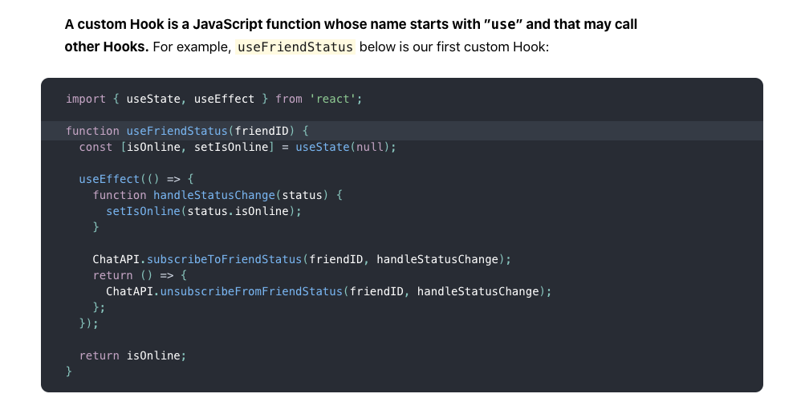
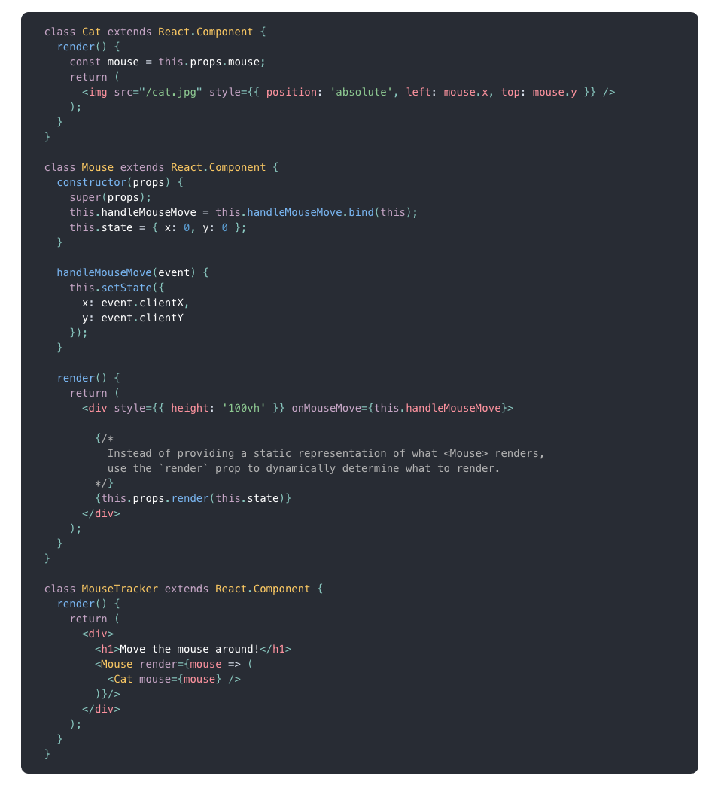
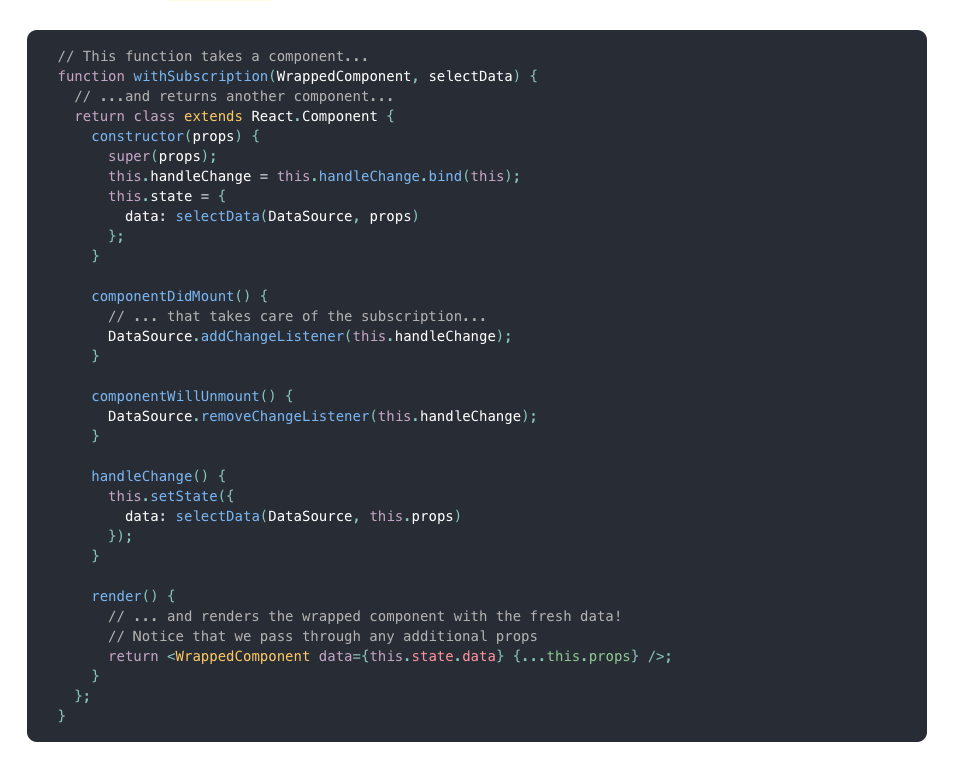

# State 로직 공유: Hooks vs render props & HOC

[https://reactjs.org/docs/hooks-custom.html](https://reactjs.org/docs/hooks-custom.html)

커스텀 Hook이 뭔지 리액트 Doc을 찾아봤더니

간단히 말해서 제공되는 Hooks를 함수로 감싸서 자주 사용되는 스테이트 관련 로직을 모듈화 시키는 것이었다.



[https://reactjs.org/docs/hooks-intro.html](https://reactjs.org/docs/hooks-intro.html)

위 글에서 Hooks의 최초 개발 철할을 볼 수 있는데 요약하자면

1. Hooks를 통해 컴포넌트 hierarchy를 손대지 않고 (ex: render props, HOC 처럼) 스테이트 관련 로직을 재사용 할 수 있다.

2. Hooks를 통해 한 컴포넌트를 (라이프사이클이 아닌) 관심사에 기반해 여러 작은 함수들로 나눌 수 있다.

3. class와 javascript의 this가 헷갈리기 때문에 class 없이 리액트를 사용할 수 있도록 만들었습니다.

위에 useFriendStatus처럼 스테이트 관련 로직을 재사용 할 수 있도록 분리시키는 것이 최초 Hooks 개발 목표 중 하나였다는 것을 볼 수 있다.

> 내부에서 state를 사용하지는 않지만 현재 메쉬코리아 프로젝트에 사용되는 useDidMount 도 일종의 custom Hook 이라고 할 수 있을듯.
>
> ```tsx
> const useDidMount = (fn: () => void) => useEffect(fn, []);
> ```

Hooks가 State 로직 공유의 새로운 방법이라면 기존에는 render props 와 HOC가 있었다고 한다.

> Traditionally in React, we’ve had two popular ways to share stateful logic between components: render props and higher-order components.

  
자신의 state를 render-props의 인수를 넘겨주어서 State를 공유하고 있는 Mouse 컴포넌트

  
리액트 컴포넌트를 return 하는 wrapper함수를 통해 data 스테이트를 공유하는 withSubscription

render-props나 hoc 코드를 보면 다 class형 컴포넌트를 사용하고, 스테이트 로직 공유를 받는 컴포넌트가 감싸지는 형식으로 컴포넌트 위계가 바뀌는 것을 볼 수 있다.
이런 부분들을 해결하기 위해 Hooks가 나온것 같고...
함수형 컴포넌트를 사용할 때에는 Hook를 잘 사용해서 스테이트 로직 공유를 하는게 좋아 보인다.

[돌아가기](../../README.md)
