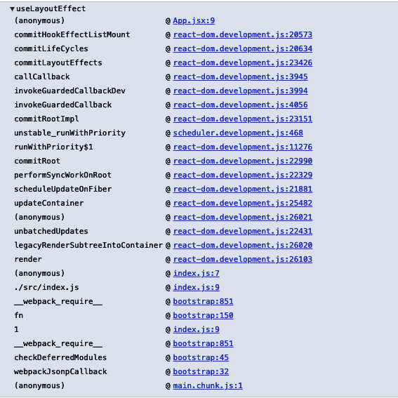
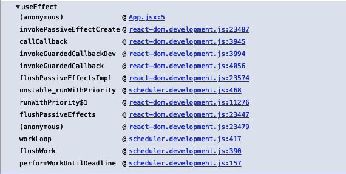
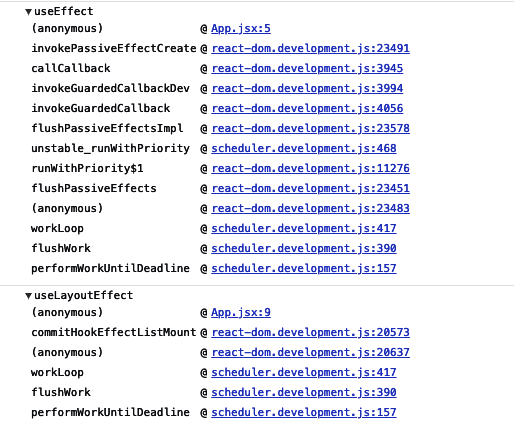

# useLayoutEffect 이해하기

## useLayoutEffect

- [https://reactjs.org/docs/hooks-reference.html#uselayouteffect](https://reactjs.org/docs/hooks-reference.html#uselayouteffect)

useLayoutEffect를 공식 문서에서는 이렇게 정의하고 있다.

> The signature is identical to useEffect, but it fires synchronously after all DOM mutations. Use this to read layout from the DOM and synchronously re-render. Updates scheduled inside useLayoutEffect will be flushed synchronously, before the browser has a chance to paint.
>
> Prefer the standard useEffect when possible to avoid blocking visual updates.
>
> 시그니쳐는 useEffect와 동일하다, 하지만 DOM Mutations 이후에 동기적으로 실행된다는 점이 다르다. DOM으로부터 layout을 읽고 동기적으로 리렌더를 하고 싶을때 사용하면 된다. useLayoutEffect 안에 스케쥴되어 있는 업데이트들은 브라우저가 페인트할 기회를 가지기 전에 동기적으로 처리된다.
>
> visual update blocking을 피하기 위해 가능하면 useEffect를 사용하세요.

## 왜 useLayoutEffect는 visual update blocking을 유발할까?`

- [https://kentcdodds.com/blog/useeffect-vs-uselayouteffect](https://kentcdodds.com/blog/useeffect-vs-uselayouteffect)

위 블로그의 설명이 좋았다. 정리요약하자면

- 왠만하면 useEffect를 사용

- useEffect 내 코드는 브라우저 페인트가 완료된 후에 실행됨. (비동기)

- 반면 useLayoutEffect, componentDidMount, componentDidUpdate, componentWillUnmount 내 코드는 페인트 실행 전에 실행됨. 그래서 만약 이 함수들 내부에 코드 연산이 많다면 JS 싱글쓰레드 특성상 비쥬얼 업데이트가 지연될수 있음. (동기)

- React.Component 마운트 후 화면이 그려지기 전까지 어떤 비쥬얼 업데이트 처리를 해야 할 때 useLayoutEffect 속에서 처리하면, 깜빡임 현상(flicker)을 방지할 수 있다.  
  (만약 useEffect 속에서 그런 비쥬얼 업데이트 처리를 한다면, **paint > Dom Mutation (useEffect callback) > repaint** 이렇게 되서 깜빡임 현상이 생길 수 있음.)

## render vs paint: The Pixel Pipeline

> The one catch is that this runs **after react renders your component(2)** and ensures that your effect callback does not block browser painting. This differs from the behavior in class components where componentDidMount and componentDidUpdate run **synchronously after rendering(1)**.

위 블로그에서 render라는 표현을 두 가지 의미로 다르게 사용해서 헷갈리게 만드는 부분이 있는데

1. paint로 화면을 업데이트 한다는 의미에서 render

2. React.Component render 함수

순서를 보자면

`React.Component render(2)` > `Dom Mutation` > `paint(1)`

인데 useLayoutEffect, useEffect를 끼워보면

`React.Component render` > `Dom Mutation` > `useLayoutEffect, componentDidMount` > `paint` > `useEffect`

이렇게 된다.


pixel pipeline과 비교해서 보면

`React.Component render` > `Dom Mutation` > `useLayoutEffect, componentDidMount`  까지가 Javascript에 속하는 부분이라고 볼수 있겠다.

이 Javascript 실행이 일단 마무리가 되야 브라우저가 비쥬얼 업데이트 (paint)를 할 기회가 있는데 `useLayoutEffect, componentDidMount`에서 연산이 길면 paint가 늦어질수 있다는 것.  
useEffect는 setTimeout 같이 다음 '이벤트'로 처리되기때문에 paint 후에 비동기로 들어감.

> 뭔가 개념이 통하는게 있는거 같아서 메모를 남긴다
> useEffect : setTimeout  
> useLayoutEffect : requestAnimationFrame

## 리액트에서 해당 차이점은 어떻게 구현이 되어 있을까?

`react v17.0.2`

```jsx
export default function App() {
  useEffect(() => {
    console.trace("useEffect");
  }, []);

  useLayoutEffect(() => {
    console.trace("useLayoutEffect");
  }, []);

  return (
    <div className="App">
      <h1>Hello CodeSandbox</h1>
      <h2>Start editing to see some magic happen!</h2>
    </div>
  );
}
```

위 코드를 실행시켜 보면




이렇게 trace 가 나오는데, useLayoutEffect > commitLayoutEffects 발생지점을 모듈 코드에서 찾아보면

react-dom 패키지 내부 commitRootImpl이라는 함수 내에서 발생한다.

commitRootImpl을 보면 많은 일들이 벌어지는데

```js
function commitRootImpl(root, renderPriorityLevel) {
  // ...코드 생략

  do {
    {
      invokeGuardedCallback(null, commitBeforeMutationEffects, null);

      if (hasCaughtError()) {
        if (!(nextEffect !== null)) {
          {
            throw Error("Should be working on an effect.");
          }
        }

        var error = clearCaughtError();
        captureCommitPhaseError(nextEffect, error);
        nextEffect = nextEffect.nextEffect;
      }
    }
  } while (nextEffect !== null); // We no longer need to track the active instance fiber

  // ...코드 생략

  nextEffect = firstEffect;

  do {
    {
      invokeGuardedCallback(
        null,
        commitMutationEffects,
        null,
        root,
        renderPriorityLevel
      );

      if (hasCaughtError()) {
        if (!(nextEffect !== null)) {
          {
            throw Error("Should be working on an effect.");
          }
        }

        var _error = clearCaughtError();

        captureCommitPhaseError(nextEffect, _error);
        nextEffect = nextEffect.nextEffect;
      }
    }
  } while (nextEffect !== null);

  // ...코드 생략

  nextEffect = firstEffect;

  do {
    {
      invokeGuardedCallback(null, commitLayoutEffects, null, root, lanes);

      if (hasCaughtError()) {
        if (!(nextEffect !== null)) {
          {
            throw Error("Should be working on an effect.");
          }
        }

        var _error2 = clearCaughtError();

        captureCommitPhaseError(nextEffect, _error2);
        nextEffect = nextEffect.nextEffect;
      }
    }
  } while (nextEffect !== null);

  nextEffect = null; // Tell Scheduler to yield at the end of the frame, so the browser has an
  // opportunity to paint.

  requestPaint();

  // ...코드 생략

  return null;
}
```

`commitBeforeMutationEffects` > `commitMutationEffects` > `commitLayoutEffects` > `requestPaint`

순으로 effect 들이 처리되고 마지막에 페인트를 요청하는것을 볼 수 있다.

이중 commitLayoutEffects를 타고가보면 commitLifeCycles 라는 함수를 볼수 있다.

```js
function commitLifeCycles(
  finishedRoot: FiberRoot,
  current: Fiber | null,
  finishedWork: Fiber,
  committedLanes: Lanes,
): void {
  switch (finishedWork.tag) {
    case FunctionComponent:
    case ForwardRef:
    case SimpleMemoComponent:
    case Block: {
      // At this point layout effects have already been destroyed (during mutation phase).
      // This is done to prevent sibling component effects from interfering with each other,
      // e.g. a destroy function in one component should never override a ref set
      // by a create function in another component during the same commit.
      if (
        enableProfilerTimer &&
        enableProfilerCommitHooks &&
        finishedWork.mode & ProfileMode
      ) {
        try {
          startLayoutEffectTimer();
          commitHookEffectListMount(HookLayout | HookHasEffect, finishedWork);
        } finally {
          recordLayoutEffectDuration(finishedWork);
        }
      } else {
        commitHookEffectListMount(HookLayout | HookHasEffect, finishedWork);
      }

      schedulePassiveEffects(finishedWork);
      return;
    }
    case ClassComponent: {
      const instance = finishedWork.stateNode;
      if (finishedWork.flags & Update) {
        if (current === null) {
          // ...코드 생략
          if (
            enableProfilerTimer &&
            enableProfilerCommitHooks &&
            finishedWork.mode & ProfileMode
          ) {
            try {
              startLayoutEffectTimer();
              instance.componentDidMount();
            } finally {
              recordLayoutEffectDuration(finishedWork);
            }
          } else {
            instance.componentDidMount();
          }
        } else {
          // ...코드 생략
          if (
            enableProfilerTimer &&
            enableProfilerCommitHooks &&
            finishedWork.mode & ProfileMode
          ) {
            try {
              startLayoutEffectTimer();
              instance.componentDidUpdate(
                prevProps,
                prevState,
                instance.__reactInternalSnapshotBeforeUpdate,
              );
            } finally {
              recordLayoutEffectDuration(finishedWork);
            }
          } else {
            instance.componentDidUpdate(
              prevProps,
              prevState,
              instance.__reactInternalSnapshotBeforeUpdate,
            );
          }
        }
      }
      // ...코드 생략
      }
      return;
    }
    // ...코드 생략
  }
}
```

FunctionComponent의 경우

```js
if (
  enableProfilerTimer &&
  enableProfilerCommitHooks &&
  finishedWork.mode & ProfileMode
) {
  try {
    startLayoutEffectTimer();
    commitHookEffectListMount(HookLayout | HookHasEffect, finishedWork);
  } finally {
    recordLayoutEffectDuration(finishedWork);
  }
} else {
  commitHookEffectListMount(HookLayout | HookHasEffect, finishedWork);
}

schedulePassiveEffects(finishedWork);
return;
```

이런 코드가 실행이 되는데
바로 `commitHookEffectListMount(HookLayout | HookHasEffect, finishedWork)` 이 코드가 useLayoutEffect 내 코드를 실행 하는 부분이고
`schedulePassiveEffects(finishedWork)` 이 코드가
useEffect의 코드를 **스케줄에 잡아놓는** 코드이다.

`schedulePassiveEffects(finishedWork)`를 타고 가다 보면

```js
export function enqueuePendingPassiveHookEffectUnmount(
  fiber: Fiber,
  effect: HookEffect
): void {
  pendingPassiveHookEffectsUnmount.push(effect, fiber);
  if (__DEV__) {
    fiber.flags |= PassiveUnmountPendingDev;
    const alternate = fiber.alternate;
    if (alternate !== null) {
      alternate.flags |= PassiveUnmountPendingDev;
    }
  }
  if (!rootDoesHavePassiveEffects) {
    rootDoesHavePassiveEffects = true;
    scheduleCallback(NormalSchedulerPriority, () => {
      flushPassiveEffects();
      return null;
    });
  }
}
```

`scheduleCallback` 안에서 `flushPassiveEffects`를 호출하는 모습이 보이는데
이 부분이 리엑트 scheduler 패키지에서 setTimeout 처럼 useEffect 내 코드를 비동기 처리해주는 것.

반면 `commitHookEffectListMount(HookLayout | HookHasEffect, finishedWork)`은 useLayoutEffect 내 코드를 `scheduleCallback`으로 처리하지 않고 그대로 동기적으로 코드를 실행한다.

만약 `commitHookEffectListMount(HookLayout | HookHasEffect, finishedWork)`도 `scheduleCallback`으로 감싸고 `schedulePassiveEffects(finishedWork)`와 순서를 바꿔보면

```js
schedulePassiveEffects(finishedWork);

{
  scheduleCallback(NormalPriority$1, function () {
    commitHookEffectListMount(Layout | HasEffect, finishedWork);
    return null;
  });
}
```

useLayoutEffect 내 코드도 비동기처리가 되고 useEffect 코드 후에 등록되기 때문에



실제로 이렇게 순서가 바뀌어서 실행이 된다.

`commitLifeCycles` 속에서 `ClassComponent`일 경우 `componentDidMount`, `componentDidUpdate`도 `useLayoutEffects`와 비슷하게 처리해주는 모습도 인상적이다.

[돌아가기](/README.md)
