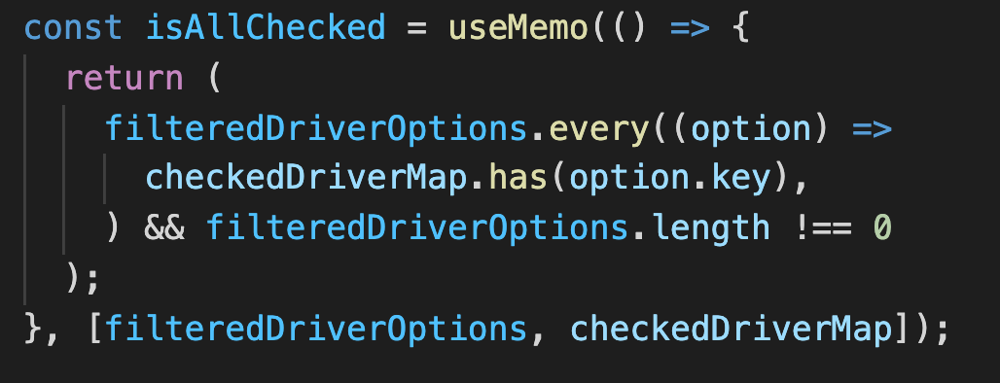
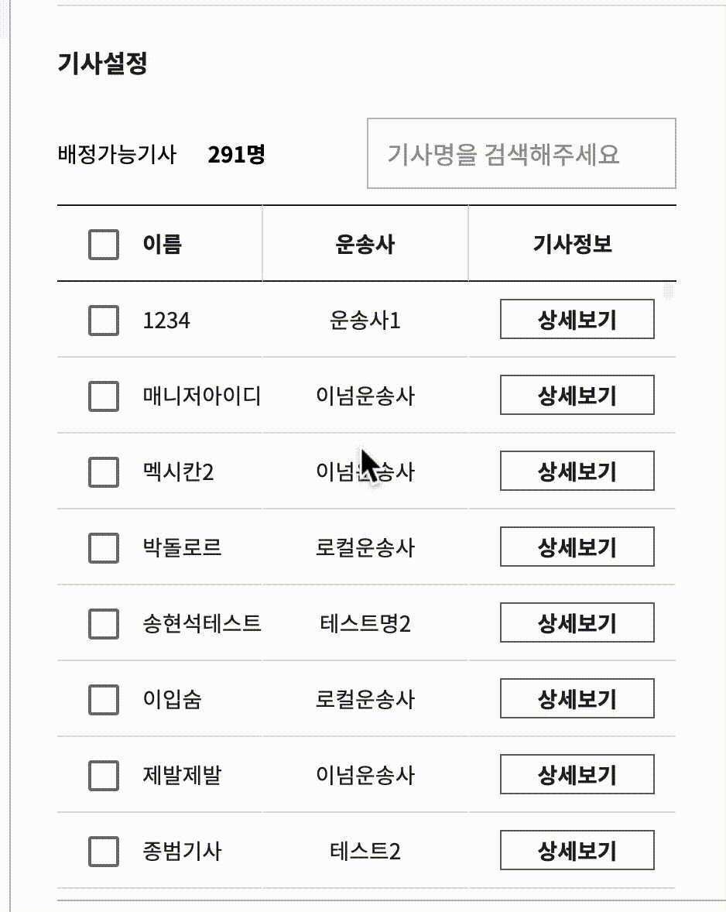

# useMemo - Dependency 내 Reference

컴포넌트를 리팩토링 하는 과정에서  
Map을 디펜던시로 사용하는 변수를 useMemo로 처리하는 코드가 있었다.

이 Map을 Map.prototype.set 과 Map.prototype.delete로 안에 데이터를 여러가지로 수정해서 변화를 줬음에도

해당 Map을 디펜던시로 가지고 있는 useMemo가 콜이 되지 않아서 ui 버그가 생기는 현상이 있었다.

리팩토링 전에는 운이 좋게 filterDriverOption이 매 렌더마다 새로 만들어져 버그는 없었는데

컴포넌트내에 코드를 컴포넌트로 구조화 시키는 과정에서 이 문제가 드러났다.

리액트 훅의 dependency 가 object일 경우 reference 체크를 하는 건 알고 있었는데,

실제로 object내 데이터가 바뀌었는데 useMemo가 불리지 않으니 당황스러웠다.

Map 뿐만이 아니라 Set, Array 도 동일하게 행동하는 것을 확인했다.

> useMemo같은 리액트 훅을 사용할 때 object형태의 dependency가 있을 경우,  
> 꼭 object 카피를 해 새로운 reference를 만들어 주어서 콜백이 확실히 불리도록 주의하자.

[돌아가기](/README.md)
