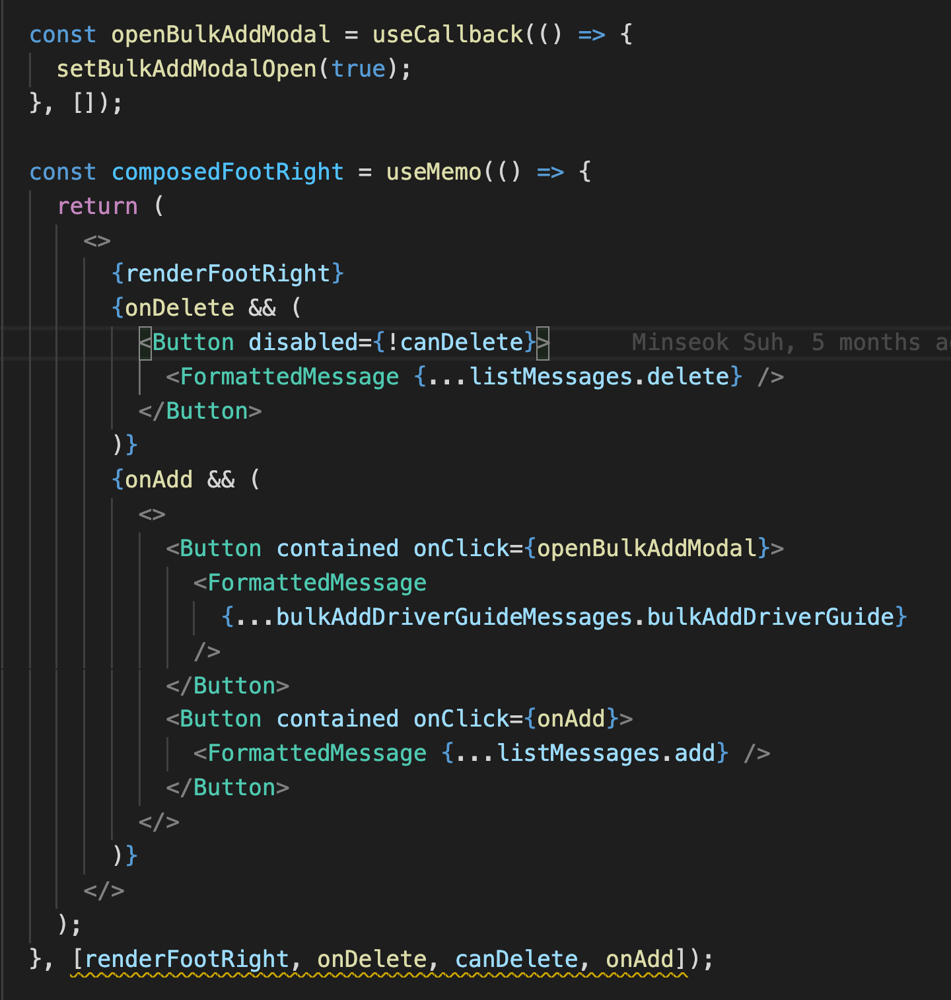
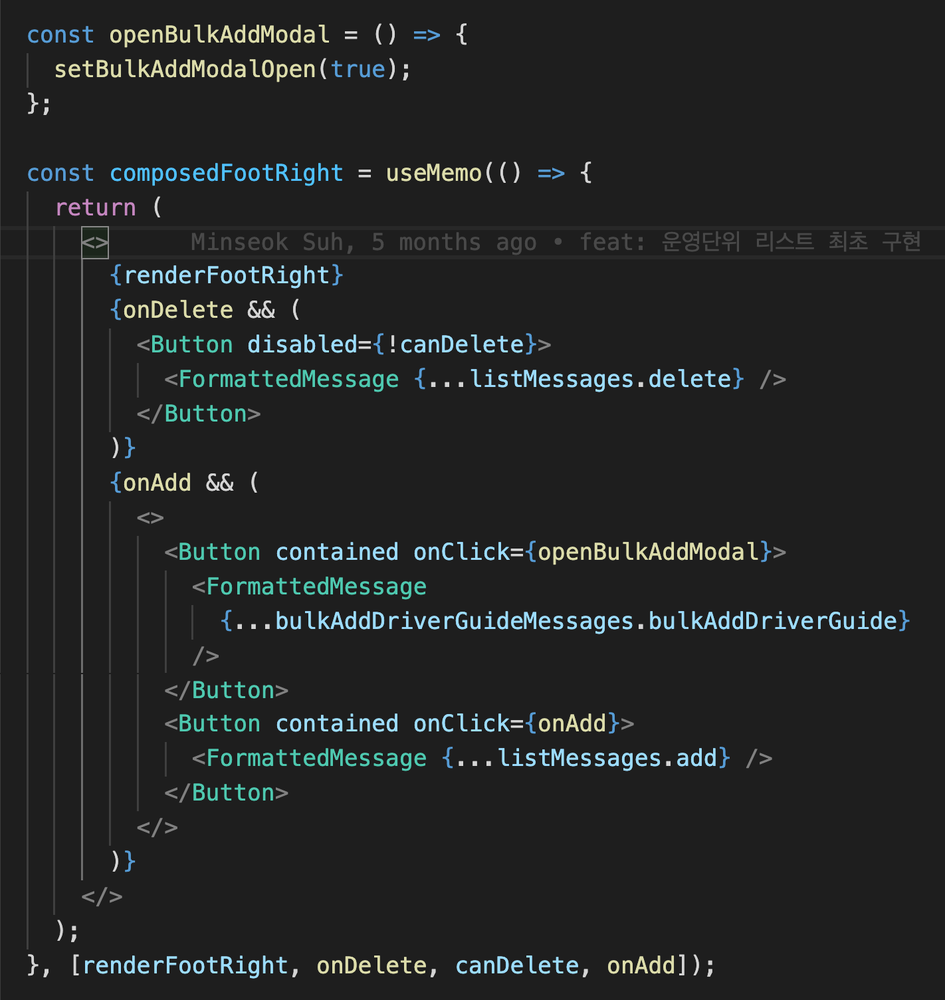

# useMemo - useCallback

나는 지금까지 useMemo 내에서 참조하고 있는 값이라면 무조건 dependency가 되는 줄 알았음.

역시 openBulkAddModal을 deps array에서 제거시키나까 warning이 뜨는구만 허허.

그런데 openBulkAddModal에서 useCallback을 제거하니 deps array에서 warning이 없어졌다??

여러가지 시도를 해보니 lint는 props나 state 즉 rerender를 일으킬 요소를 참조하고 있는 함수는 dependency가 적용을 하라고 warning을 준다.
(useState로 제공되는 setState는 warning이 없다)

TODO
\*\*이건 리액트라기보다는 eslint 룰을 체크해야 할것 같다.

[돌아가기](/README.md)
