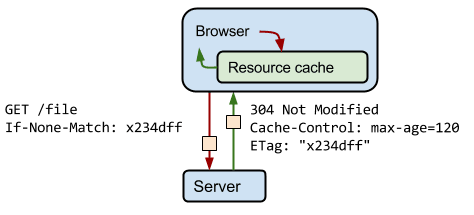

# HTTP Cache를 사용해서 불필요한 네트워크 요청을 방지하자

이 글 [https://web.dev/http-cache/](https://web.dev/http-cache/)을 번역했습니다.

리소스를 네트워크를 통해서 가져오는것은 느리고 비용이 큽니다:

- 큰 Response는 브라우저와 서버간 여러번의 왕복을 필요로 합니다.
- 주요 리소스들이 완전히 다운로드 되기 전에는 페이지가 로드 되지 않을 것입니다.
- 만약 사용자가 당신의 사이트를 제한된 요금제로 이용할 경우, 모든 불필요한 네트워크 요청은 그들의 돈을 낭비하는 것입니다.

어떻게 불필요한 네트워크 리쿼스트를 피할 수 있을까요? 브라우저의 HTTP Cache가 당신의 첫 방어선입니다!  
가장 강력하거나 유연한 방법이라고 할 수 없고, 당신은 캐시된 Response에 대해 제한적인 컨트롤 밖에 가지지 못하지만,Cache는 효과적입니다. 모든 브라우저가 캐시를 지원하고 있고, 캐시를 세팅하는데 큰 작업이 필요하지 않기 때문입니다.

이 가이드는 효과적인 HTTP Caching을 적용하기 위한 기본을 알려줄 것입니다.

## 브라우저 호환성

HTTP Cache라는 하나의 API는 존재하지 않습니다. 몇 웹 API들의 묶음을 일반적으로 Cache라고 부르는 것 뿐입니다.
이 API 들은 모든 브라우저에서 지원됩니다:

- [Cache-Control](https://developer.mozilla.org/ko/docs/Web/HTTP/Headers/Cache-Control#Browser_compatibility)
- [ETag](https://developer.mozilla.org/ko/docs/Web/HTTP/Headers/ETag#Browser_compatibility)
- [Last-Modified](https://developer.mozilla.org/ko/docs/Web/HTTP/Headers/Last-Modified#Browser_compatibility)

## HTTP 캐시는 어떻게 작동하나요

모든 HTTP 요청은 우선적으로 브라우저 캐시를 체크합니다. 해당 요청에 대해 캐시된 유효한 reponse가 있는지 확인하고 만약 있다면 Response를 캐시로부터 가져옵니다. 이것은 네트워크 왕복으로 생기는 네트워크 지연과 데이터 비용을 없애도록 해줍니다.

HTTP Cache의 행동은 Request 헤더와, Response 헤더에 의해 통제됩니다.  
이상적인 시나리오라면, 당신은 웹 어플리케이션의 코드와 (Request 헤더를 담당하는) 웹 서버의 코드 (Response 헤더를 담당하는) 양쪽에 대한 조정이 가능할 것입니다.

MDN의 [HTTP Caching](https://developer.mozilla.org/ko/docs/Web/HTTP/Caching)을 통해 더 깊이 있는 개념적인 설명을 읽어보세요.

## Request 헤더: 왠만하면 default를 따라라

당신의 웹 앱이 리퀘스트를 할때 중요한 헤더는 많이 있지만  
브라우저는 왠만하면 언제나 당신 대신에 해당 중요 헤더들을 리퀘스트에 적용해줄 것입니다.
데이터의 신선도를 체크하는 헤더들은 (EX: If-None-Match If-Modified-Since) 브라우저가 현재 캐시내에 있는 값들에 대한 정보를 바탕으로 적용여부가 결정됩니다.

이것은 좋은 소식입니다--당신이 `` 같은 태그를 사용하면 브라우저가 자동으로 캐싱처리를 해준다는 뜻이기 때문입니다.

## Response 헤더: 웹 서버를 설정하라

서버에서 캐싱관련해서 할수 있는 가장 중요한 셋업은 Response 헤더이다. 이 헤더들은 모두 효과적인 캐싱에 중요한 역활을 한다:

- Cache-Control. 서버는 Cache-Control 지시어(directive)를 통해 브라우저와 다른 중간 cache들이 어떻게, 얼마나 오래 캐싱을 할지 정할 수 있다.
- ETag. 브라우저가 만료된 (유통기한이 지난) 캐시 Response를 확인한다면, 작은 토큰을 (보통 파일 컨텐트의 hash를 사용한다) 서버에 보내 파일이 변했는지 확인한다. 만약 서버가 같은 토큰을 돌려준다면, 그 파일은 바뀌지 않았기 때문에 다시 다운로드 할 필요가 없다.
- Last-Modified. 이 헤더는 Etag와 비슷한 목적으로 사용되지만, 수정 시간을 기반으로 해당 리소스가 바뀌었는지 체크한다. 이것은 Etag의 컨텐트 기반 체크방식과 대비된다.

어떤 웹 서버들은 default로 캐싱관련 해더들을 적용하는 반면, 어떤 웹 서버들은 전혀 적용하지 않기도 한다. 헤더를 설정하는 방법은 웹 서버마다 다 다르기 때문에 해당 웹 서버의 문서를 참고 하는게 가장 정확하고 좋을거다.

당신의 시간을 아껴드리기 위해, 여기 유명한 웹 서버들을 설정하는 방법을 알려주는 링크를 남긴다.

- Express
- Apache
- nginx
- Firebase Hosting
- Netlify

Cache-Control Response 헤더를 적용하지 않는 것은 HTTP Caching을 비활성화 하지 않는다!  
브라우저는 특정 컨텐트에 어떤 캐싱 행동이 적합할지를 추정하고 알아서 적용시킨다.
아마도 당신은 자동으로 설정해주는 것보다 고도화된 컨트롤을 바랄 것이다, 그러므로 시간을 투자해 당신의 Response 헤더를 설정하는것을 권장한다.

## 어떤 Response Header를 사용해야 할까요

서버의 Response 헤더를 설정할때 2가지의 시나리오를 생각해봐야 합니다.

1. 버저닝 된 URL에 대한 장기간(long-lived) 캐싱

> 잠깐! 버저닝 된 URL이 뭐고 캐싱에 무슨 도움이 되죠?
>
> 당신의 서버가 브라우저에게 css 파일을 1년동안 캐싱하라고 `Cache-Control: max-age=31536000` 지정해주었다고
> 합시다. 그런데 디자이너가 바로 배포 되어야 하는 긴급 업데이트를 했어요. 어떻게 브라우저에게 "이전" 캐싱된 파일을
> 업데이트 하라고 알려주죠? URL이 변경되지 않는다면 그것이 불가능합니다. 브라우저가 한번 파일을 캐싱하면 `max-age` 또는
> `expires`으로 설정된 "유통기한"이 지나지 않는다면 계속 그 캐싱된 파일을 사용합니다.
> (아니면 사용자가 브라우저 캐시를 > 강제로 제거하는 경우도 있겠네요)
> 그 결과로 다른 사용자들이 다른 버전의 파일을 사용하게 되는 경우가 있을 수 있습니다: 방금 전에 최신 리소스를 받은 사용자는
> 최신 파일을 사용할테고, 업데이트 이전에 리소스를 받아 캐싱한 사용자는 이전 파일을 사용하겠죠.
> 그러면 어떻게 캐싱과 재빠른 업데이트 두마리 토끼를 다 잡을수 있을까요?
> 컨텐트가 업데이트 될때 리소스의 URL을 바꿔 유저가 강제로 새로운 파일을 다운로드 받도록 하는 것입니다!
> 일반적으로 fingerprint나 버전명을 파일명에 포함시켜 이런 결과를 만들어 냅니다. 예를 들면 `style.x234dff.css`
> 이런 식으로 말이죠.

fingerprint나 버전 정보가 들어간 URL에 대한 Request는 (그리고 그 컨텐트가 쉽게 바뀌지 않을 거라면)  
Response에 `add Cache-Control: max-age=31536000` 를 붙여주세요.

이 헤더를 적용함으로써 브라우저가 같은 URL에 향후 1년동안 (31,536,000초; 지원되는 최대값) 요청하는 일이 있다면,  
바로 HTTP Cache에 있는 정보를 사용하라고 알려주게 됩니다. 당신의 웹 서버에 불필요한 네트워크 요청을 할 일이 없어지겠죠.  
그레이트 - 당신은 방금 안정적으로 네트워크를 피해서 속도를 얻어낼 수 있었습니다!

웹팩 같은 빌드 도구를 사용하면 당신의 asset URL에 자동으로 해쉬 fignerprints를 적용시킬 수 있습니다.

> `immutable` 을 `Cache-Control` 헤더에 추가해서 더욱 최적화 시킬수 있습니다.
> 하지만 특정 브라우저에선 해당 설정이 무시될 것입니다.

## 버저닝 되지 않은 URL에 대한 서버 재인증 (revalidation)

불행하게도, 당신이 요청하는 모든 URL이 버저닝이 되어 있지는 않을 것입니다. 당신이 웹앱을 배포하기 전에 버저닝이 포함된 빌드과정을 적용하지 못했을 수도 있죠. 그리고 모든 웹앱은 HTML 파일을 필요로 합니다 - 이 파일들은 거의 버저닝이 되어 있지 않을 겁니다. 사람들이 당신의 `https://example.com/index.34def12.html` 주소를 기억하고 사용하지는 않을 것이기 때문이죠. 이처럼 버저닝이 되지 않은 URL에 대해서는 어떻게 처리해야 할까요?

이 시나리오에선 당신은 패배를 인정해야 합니다. HTTP 캐싱 단독으로는 네트워크를 완전히 피할만큼 강력하지 않기 때문이죠.
(걱정마세요 곧 전투를 당신이 원하는 방향이로 이끌수 있는 [service workers](https://web.dev/service-workers-cache-storage/)에 대해 배울거니까요!) 하지만 이런 상황에서 당신이 네트워크 요청이 최대한 빠르고 효율적이게 할수 있는 몇가지 방법이 있습니다.

이하의 `Cache-Control` 값들은 버저닝 되지 않은 URL에 대해서의 캐싱을 커스터마이즈 할수 있도록 해줄 것입니다.

`no-cache` 이 값은 브라우저에게 캐시된 버전을 사용하기 전에 "언제나" 서버에게 먼저 검토를 받으라고 지시합니다.
`no-store` 이 값은 브라우저와 다른 중간 캐시에게 (CDNs 같은) 절대 이 파일을 저장하지 말라고 지시합니다.
`privte` 브라우저는 해당 값을 캐시할수 있지만 중간 캐시들은 (CDNs 같은) 할 수 없습니다.
`public` 이 response는 어떤 캐시에도 저장될 수 있습니다.

> [부록: Cache-Control 플로우차트](#flowchart)를 통해 어떤 Cache-Control 값을 사용해야 할지 감을 잡으세요.  
> 또 Cache-Control이 ","로 구분된 값들을 한번에 받을수 있다는 점도 기억하세요. [부록: Cache-Control 예제](#example)를 보세요.

추가적으로, 한두개의 Reponse 헤더를 추가해주는 것도 도움이 됩니다: `Etag`나 `Last-Modified` 말이죠.
위에서 설명했듯이, `Etag`나 `Last-Modified`는 둘다 같은 이유로 사용됩니다: 브라우저가 "유통기한"이 지난 캐쉬된 파일을 다시 받아야 하는지 결정하는데에 사용되죠. `Etag`가 더 정확하기 때문에 권장드립니다.

> Etag 예시
>
> 최초 요청을 하고 120초가 지난후 다시 같은 리소스에 대한 요청을 서버에 했다고 합시다.
> 첫째로 브라우저는 Cache를 학인하고 최초 요청에서 받았던 Response를 찾아냅니다.
> 불행하게도 브라우저는 이 Response가 만료되었기 때문에 사용할 수 없습니다.
> 이 상황에서 브라우저는 아예 새로운 리퀘스트를 해서 새로운 완전한 Response를 받을 수도 있지만,
> 이것은 만약 리소스가 바뀌지 않았다면 비효율적일 것입니다. 왜냐하면 해당 리소스는 이미 캐시안에 있을 테니까 말이죠!
> 이 비효율성을 해결하기 위해 Etag가 존재합니다. 서버는 임의의 토큰을 발행해서
> (일반적으로 파일 컨텐트의 fingerprint나 hash가 사용됩니다.) response로 돌려줍니다.
> 브라우저는 해당 fingerprint가 어떻게 생성되었는지 알 필요가 없습니다; 다음 요청때 서버에 보내기만 하면 됩니다.
> 만약 fingerprint가 동일하다면, 리소스는 바뀌지 않았기 때문에 브라우저는 재 다운로드 하지 않아도 됩니다.

`Etag`나 `Last-Modified`를 적용함으로서 당신은 재인증 요청을 훨씬 효율적으로 만들 수 있습니다.
위의 값들은 결국 리퀘스트 헤더에 적용된 `If-Modified-Since` 또는 `If-None-Match` 와 작용하며 리퀘스트를 최적화시켜줄 것입니다.

제대로 설정이 된 웹 서버가 위와 같은 Request 헤더들을 감지하면, 브라우저가 캐시에 이미 가지고 있는 리소스의 버전이 서버의 최신 버전과 같은지 확인을 해줄 것입니다. 만약 리소스가 동일하다면, 서버는 `304 Not Modified` HTTP Response를 돌려줄 것입니다. "야, 너가 가지고 있는거 그냥 써라" 라는 말이죠. 이런 종류의 Response를 보낼 때에는 굉장히 적은 데이터만 보내주면 되어서, 일반적으로 실제 리소스의 카피를 보내주는것보다 훨씬 빠르게 일을 처리할 수 있게 됩니다.

> 브라우저는 서버에게 /file을 요청하면서 `If-None-Match` 헤더를 추가해 서버에게 파일의 `Etag` 값이 브라우저가 보낸 `If-None-Match`의 값과 다를 경우에만 완전한 파일을 달라고 지시합니다. 이 경우에는 두 값이 일치했기 때문에 서버가 `304 Not Modified` Response를 돌려주고 파일이 얼마나 더 캐시될지에 대해 `Cache-Control: max-age=120`으로 가이드를 줍니다.

## 요약

HTTP Cache는 불필요한 네트워크 요청을 줄여 load 퍼포먼스를 향상시킬 수 있는 효과적인 방법입니다.  
모든 브라우저에서 지원되고 많은 작업을 필요로 하지 않습니다.

이하의 Cache-Control 설정은 좋은 출발점입니다:

- `Cache-Control`: no-cache - 매번 서버에 재확인 되어야 하는 리소스에 대해 적용
- `Cache-Control`: no-store - 절대 캐시되지 말아야 할 리소스에 대해 적용
- `Cache-control`: max-age=3153600 - 버저닝 된 리소스에 대해 적용
- `Etag`, `Last-Modified`: 캐싱 기간이 만료된 리소스를 더 효율적으로 처리할수 있도록 도와줌

## 더 배워보세요

Cache-Control 헤더에 대해 더 깊이 배우고 싶으시다면, Jake Archibald의 [Caching best practices & max-age gotchas](https://jakearchibald.com/2016/caching-best-practices/) 가이드를 읽어보세요.

## 부록: 추가 팁

시간이 더 있다면, 여기 당신의 캐싱을 더욱 최적화 시킬수 있는 방법이 있습니다.

- 일관성있게 URL을 사용하세요. 만약 같은 컨텐트를 다른 URL로 서빙해준다면, 그 컨텐트는 여러번 fetch되고 저장될 것입니다.
- 뒤섞임을 최소화하세요. 리소스의 어떤 부분이 (예를들어 CSS 파일같은) 자주 업데이트 되고, 그 리소스의 나머지 부분 (예를 들어 라이브러리 코드같은) 자주 업데이트 되지 않는다면, 자주 업데이트 되는 코드를 별개의 파일로 나눠주세요. 자주 업데이트 되는 코드에 대해서는 단기간 캐싱 전략을 적용하시고 자주 업데이트 되지 않는 코드에 대해서는 장기간 캐신 전략을 적용하세요.
- 만약 당신의 캐싱 정책이 어느 정도의 staleness를 (유통기한이 지남) 허용한다면 새로운 `state-while-revalidate` 값을 사용해 보세요. (유통기한이 어느정도 지나도 캐시에 저장된 리소스를 사용하게 함으로서 속도를 얻는 기법. 캐시된 리소스의 빠른 사용을 방해하지 않으면서 백그라운드에서 서버에게 해당 리소스에 대한 요청을 해 캐시 리소스도 업데이트 한다.)

## 부록: Cache-Control 플로우차트

## 부록: Cache-Control 예제

| Cache-Control 값         | 설명                                                                                   |
| ------------------------ | -------------------------------------------------------------------------------------- |
| max-age=86400            | Response가 브라우저와 중간 캐시들에게 1일동안 캐싱될수 있습니다 (60초 x 60분 x 24시간) |
| private, max-age=600     | Response가 브라우저에게만 (중간 캐시들 제외) 10분동안 캐싱될수 있습니다 (60초 x 10분)  |
| public, max-age=31536000 | Response가 어떤 캐시든 1년동안 캐싱될 수 있습니다                                      |
| no-store                 | 이 Response는 캐싱될 수 없고 언제나 서버에게 완전한 파일을 받아야 합니다.              |

[돌아가기](/README.md)
