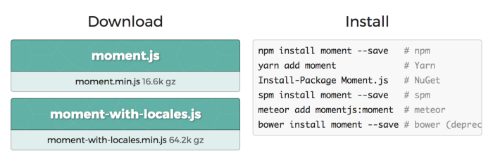

# 공룡들을 위해 설명한 현대 자바스크립트

이 글 [https://medium.com/the-node-js-collection/modern-javascript-explained-for-dinosaurs-f695e9747b70](https://medium.com/the-node-js-collection/modern-javascript-explained-for-dinosaurs-f695e9747b70)을 요약 번역했습니다.

> Browserify lets you require(‘modules’) in the browser by bundling up all of your dependencies.

필자는 2014년도에 Browserify를 설명한 위 글을 보고 이해를 하지 못했습니다.

이 글의 목적은 자바스크립트 툴들이(npm, webpack, babel 등) 만들어진 역사적 배경을 설명해 현대 자바스크립트 생태계에 대한 이해도를 높이는 것입니다.

## "올드스쿨" 방식 자바스크립트

예전에는 필요한 패키지가 있다면



여기서 min 파일을 다운받아 html에 링크를 걸어주었습니다.

```html
<!-- index.html -->
<!DOCTYPE html>
<html lang="en">
  <head>
    <meta charset="UTF-8" />
    <title>Example</title>
    <link rel="stylesheet" href="index.css" />
    <script src="moment.min.js"></script>
    <script src="index.js"></script>
  </head>
  <body>
    <h1>Hello from HTML!</h1>
  </body>
</html>
```

moment가 index.js 보다 먼저 로드되기 때문에
index.js 에서

```js
// index.js
console.log("Hello from JavaScript!");
console.log(moment().startOf("day").fromNow());
```

이런 식으로 라이브러리를 가져다 사용할 수 있었습니다.

- 장점: 이해하기 쉽다.
- 단점: 라이브러리 버전이 새로 나올때마다 찾고 다운로드 하기 귀찮다.

## 자바스크립트 패키지 매니저 (npm)

2010년 쯤부터 패키지를 다운로드 하고 업그레이드 하는 과정을 자동화 하기 위해

중앙 저장소를 통해 관리되는 패키지 매니저 들이 등장하기 시작했습니다. (Bower, npm, yarn)

npm install moment --save를 하면

```json
{
  "name": "modern-javascript-example",
  "version": "1.0.0",
  "description": "",
  "main": "index.js",
  "scripts": {
    "test": "echo \"Error: no test specified\" && exit 1"
  },
  "author": "",
  "license": "ISC",
  "dependencies": {
    "moment": "^2.22.2"
  }
}
// 저희가 워낙 많이 보는 package.json 파일이니 자세한 생략하겠습니다
```

```html
<!-- index.html -->
<!DOCTYPE html>
<html lang="en">
  <head>
    <meta charset="UTF-8" />
    <title>JavaScript Example</title>
    <script src="node_modules/moment/min/moment.min.js"></script>
    <script src="index.js"></script>
  </head>
  <body>
    <h1>Hello from HTML!</h1>
  </body>
</html>
```

이제 이런 식으로 npm을 통해 패키지를 설치하고 node_modules에서 불러올 수 있습니다.

- 장점: npm이 패키지 다운로드와 업데이트를 관리해준다.
- 단점: node_modules 폴더에서 패키지 위치를 찾아 직접 html에 넣어주어야 함.

## 자바스크립트 모듈 번들러 (webpack)

일반적으로 프로그래밍 언어들은 한 파일에서 다른 파일의 코드를 import 해서 사용할 수 있는 방법을 제공합니다.

**자바스크립트는 브라우저상에서만 동작하고, 보안상 클라이언트 컴퓨터의 파일 시스템에 접근하면 안되게 때문에 해당 import 기능이 언어 설계에 포함되지 않았습니다.**

그렇기 때문에 굉장히 오랬동안 자바스크립트 코드를 여러 파일에 관리하는것은, 파일을 하나 하나 로드 해서 global variable로 사용하도록 처리했습니다.

2009년도에 CommonJS 라는 프로젝트를 통해 브라우저 밖에서 자바스크립트 모듈 기능에 대한 스펙이 정해졌습니다.
드디어 자바스크립트에서도 global variables를 사용하지 않고 코드 import, export가 가능해진 것입니다.
이 스펙을 구현해 낸 것이 node.js 입니다.

```js
// index.js
var moment = require("moment");
console.log("Hello from JavaScript!");
console.log(moment().startOf("day").fromNow());
```

node.js는 node module의 경로를 알기 때문에  
require('./node_modules/moment/min/moment.min.js) 이렇게 쓸 필요없이  
require('moment') 요렇게만 해줘도 됩니다.

**문제는 이 import 시스템이 서버 자바스크립트인 node 에서만 돌아가고, 브라우저에서는 동작하지 않는다는 점입니다.** 브라우저는 파일 시스템에 접근할 수 없기 때문에 이런 식으로 모듈을 관리하는게 어렵습니다. - 파일을 로딩하는 것이 dynamically 처리되어야 하기 때문입니다. (synchronous: 실행 속도가 느려짐, asynchronous: 타이밍 문제가 있을 수 있음)

여기서 모듈 번들러가 사용됩니다.

모듈 번들러는 빌드 과정을 통해 해당 문제를 해결합니다.

예를 들어, 자바스크립트 파일들에 있는 require문을 실제 코드로 바꿔주는 역활을 합니다.

빌드 후 나오는 결과물은 하나의 자바스크립트 파일 (ex: main.js)이 되겠죠.

장점:

1. 외부 스크립트를 더 이상 글로벌 변수로 관리하지 않는다.
2. html에 script 태그를 사용하는 대신, require로 라이브러리를 추가한다.
3. 하나의 번들 파일을 사용하는 것이 일반적으로 퍼포먼스가 더 좋다.
4. 빌드 프로세스가 추가 되었기 때문에 다른 새로운 기능을 사용할 수 있다. (Transpile)

## Transpliler를 통해 새로운 언어 기능 사용

코드를 transpile 한다는 것은 한 언어를 비슷한 다른 언어로 바꿔준다는 말입니다.

css - Sass, Less, Stylus
Javscript - CoffeScript, babel, Typescript

Babel은 자바스크립트를 새로운 언어로 바꿔주지는 않지만 최신 자바스크립트 문법을 예전 브라우저에서 사용할 수 있도록 안정적인 문법으로 바꿔줍니다.

```js
// webpack.config.js
module.exports = {
  mode: "development",
  entry: "./index.js",
  output: {
    filename: "main.js",
    publicPath: "dist",
  },
  module: {
    rules: [
      {
        test: /\.js$/,
        exclude: /node_modules/,
        use: {
          loader: "babel-loader",
          options: {
            presets: ["@babel/preset-env"],
          },
        },
      },
    ],
  },
};
// babel 사용에 웹팩이 필요한 것은 아닙니다.
// cli로도 babel transpile이 가능합니다.
// Material-UI의 package.json을 보면
// build:es2015": "cross-env NODE_ENV=production babel ./src --ignore *.spec.js --out-dir ./build"
```

```js
// index.js
var moment = require("moment");
console.log("Hello from JavaScript!");
console.log(moment().startOf("day").fromNow());
var name = "Bob",
  time = "today";
console.log(`Hello ${name}, how are you ${time}?`);
```

ES2015 문법인 template string을 babel로 transpile 하면

```js
// main.js
// ...
console.log("Hello " + name + ", how are you " + time + "?");
// ...
```

이렇게 바꿔줍니다.

async/await, import 등 여러 편한 최신 문법을 개발자가 사용할 수 있도록 하는 Babel.

## Task Runner (npm scripts)

어차피 빌드 스텝이 생겼기 때문에, 여러 빌드 과정들을 자동화 하는 task runner를 사용하는게 좋아보입니다.
프론트엔드 개발로 치면

- 코드 minify
- image 최적화
- test 실행

등이 빌드 과정에서 처리해야할 일들이겠죠.

Grunt, Gulp 등이 초기 task runner로 주목을 받았지만  
현재는 npm 내장인 sripting 기능을 주로 사용합니다.

```json
{
  "name": "modern-javascript-example",
  "version": "1.0.0",
  "description": "",
  "main": "index.js",
  "scripts": {
    "test": "echo \"Error: no test specified\" && exit 1",
    "build": "webpack --progress -p",
    "watch": "webpack --progress --watch",
    "server": "webpack-dev-server --open"
  },
  "author": "",
  "license": "ISC",
  "dependencies": {
    "moment": "^2.19.1"
  },
  "devDependencies": {
    "@babel/core": "^7.0.0",
    "@babel/preset-env": "^7.0.0",
    "babel-loader": "^8.0.2",
    "webpack": "^3.7.1",
    "webpack-dev-server": "^3.1.6"
  }
}
```

이렇게 script를 설정해 놓으면

> npm run server

같이 간단히 빌드 태스크를 실행할 수 있습니다.

## 결론

생 html과 JS를 사용하다

- **패키지 매니저**를 통해 3rd party 라이브러리들을 자동으로 관리하고
- **모듈 번들러**를 통해 여러 JS 파일들을 하나의 JS 파일로 만들고
- **트랜스파일러**를 통해 새로운 자바스크립트 기능을 사용하고
- **태스크 러너**를 통해 빌드 과정의 여러 부분을 자동화 합니다.

여러 도구를 사용하는게 어려울 수 있지만,  
각각 도구들이 개발자에게 주는 이점이 확실하기 때문에,  
이런 도구들을 잘 이해하고 적재적소에 활용하는게 중요할 듯 합니다.

[돌아가기](/README.md)
