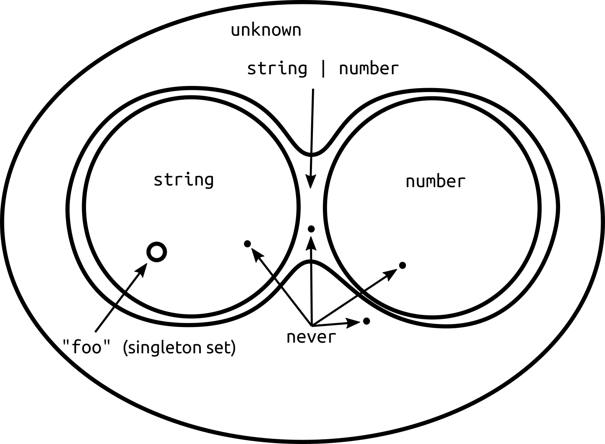

# Extends와 타입의 관계

<!-- [https://stackoverflow.com/questions/56916532/difference-b-w-only-exclude-and-omit-pick-exclude-typescript](https://stackoverflow.com/questions/56916532/difference-b-w-only-exclude-and-omit-pick-exclude-typescript) -->

typescript의 conditional 타입을 다뤄보다가 extends의 개념이 잘 이해가 안되서 정리를 해보려고 한다.

내가 헷갈렸던 부분은

```ts
type TestType = string extends number | string ? true : false;
// TestType = true;

type TestType = number | string extends string ? true : false;
// TestType = false;
```

위 코드를 보면 "|" 를 통해서 붙여진게 많을 수록 extends 오른쪽에 위치할 수 있었나 싶었는데

```ts
type TestType = { test: number } extends { test: number; test2: string }
  ? true
  : false;
// TestType = false;

type TestType = { test: number; test2: string } extends { test: number }
  ? true
  : false;
// TestType = true;
```

이런 오브젝트 내 property 관련해서는 뭐가 늘어날 수록 반대로 extends 왼쪽에 위치하게 되더라

> _아닌 경우도 있음_
>
> ```ts
> type TestType = { test: number } extends { test: number; test2?: string }
>   ? true
>   : false;
> // TestType = true;
> ```

결론적 말하면 A extends B 일때,  
B가 A를 **포함할** 수 있으면 true 고 아니면 false다.

[https://blog.logrocket.com/when-to-use-never-and-unknown-in-typescript-5e4d6c5799ad/](https://blog.logrocket.com/when-to-use-never-and-unknown-in-typescript-5e4d6c5799ad/)

위 글에서 타입에 관한 정의를 잘 설명해 주고 있는데.

> When you get down to a fundamental definition a type is a set of possible values, and nothing more.  
> 결국 타입은 가능한 값들의 집합이다.



"string | number" 의 경우 string 도 가능하고 number도 가능하기 때문에 "string extends string | number" 가 말이 되지만  
"{test: number, test2: number}" 는 "{test: number}" 보다 범위가 작은, 즉 포함할 수 있는 값의 수가 적은 타입이기 때문에  
"{test: number} extends "{test: number, test2: number}" 가 말이 되지 않는 것이다.

```ts
type TestType = { test: number; test2?: string | number } extends {
  test: number;
  test2?: string;
}
  ? true
  : false;
```

위 타입이 false 인 이유는

```ts
const test = {
  test: 1,
  test2: 2,
};
```

같은 데이터가 extends 왼쪽 타입에서는 가능하고 오른쪽 타입에서는 불가능하기 때문이다.

뭔가 쓰고 보니 당연한 말을 어렵게 쓴거 같은데, 그냥 내가 타입과 상속에 대해서 잘 몰라서 생긴 일 같다.

어쨌든 적으면서 좀 이해가 되서 다행이다.

[돌아가기](../../README.md)
