# 제네릭 타입을 사용하는 리액트 드랍다운을 만들어 보자

## What is the problem?

메쉬코리아에서 개발해 관리하는 리액트 컴포넌트 라이브러리인 vroong-design-system 안에는
드랍다운 컴포넌트가 있다.

이 드랍다운 컴포넌트는 선택지를 만들어주는 options 프라퍼티를 필수적으로 받고 있는데,
아래 옵션 데이터를 배열로 받고 있다.

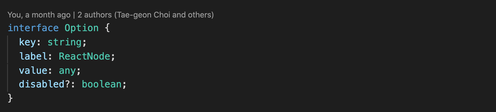

- 코드 내부적으로 데이터를 찾고 관리하기 위해 사용되는 key
- 사용자에게 보여질 옵션을 설정하기 위해 사용되는 label
- 그리고 실제 해당 옵션의 데이터인 value

그런데 현재 value의 타입이 any로 설정이 되어 있어서 컴포넌트 사용중 생기는 문제가 있다.
분명히 드롭다운 컴포넌트 내에서 옵션마다 사용되는 value의 형태는 같은데 코드 상에서 그 타입을 유추해 내지 못하기 때문에

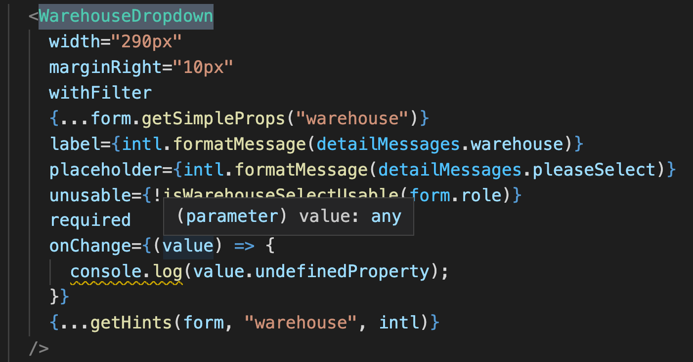

위의 onChange 처럼 없는 프라퍼티에 접근하는게 가능해진다던가, value로 만약 undefined 가 들어간다면

> Uncaught TypeError: Cannot read property 'please' of undefined

를 볼 수도 있다.

## 컴포넌트에 제네릭 타입을 사용해 문제 해결 해보기

만약 일반함수에 제네릭 타입을 정해 사용하듯이 컴포넌트에도 제네릭 타입을 사용할 수 있다면  
option의 value로 어떤 값을 사용하는지 특정할 수 있고  
value가 any여서 생길 수 있는 여러 문제를 미연에 방지 할 수 있을 것이다.

### 구현법

우선 드랍다운이 받는 프라퍼티 interface가 제네릭을 사용하도록 수정한다.
value 타입과 options 타입에도 제네릭 타입을 적용시켜준다.

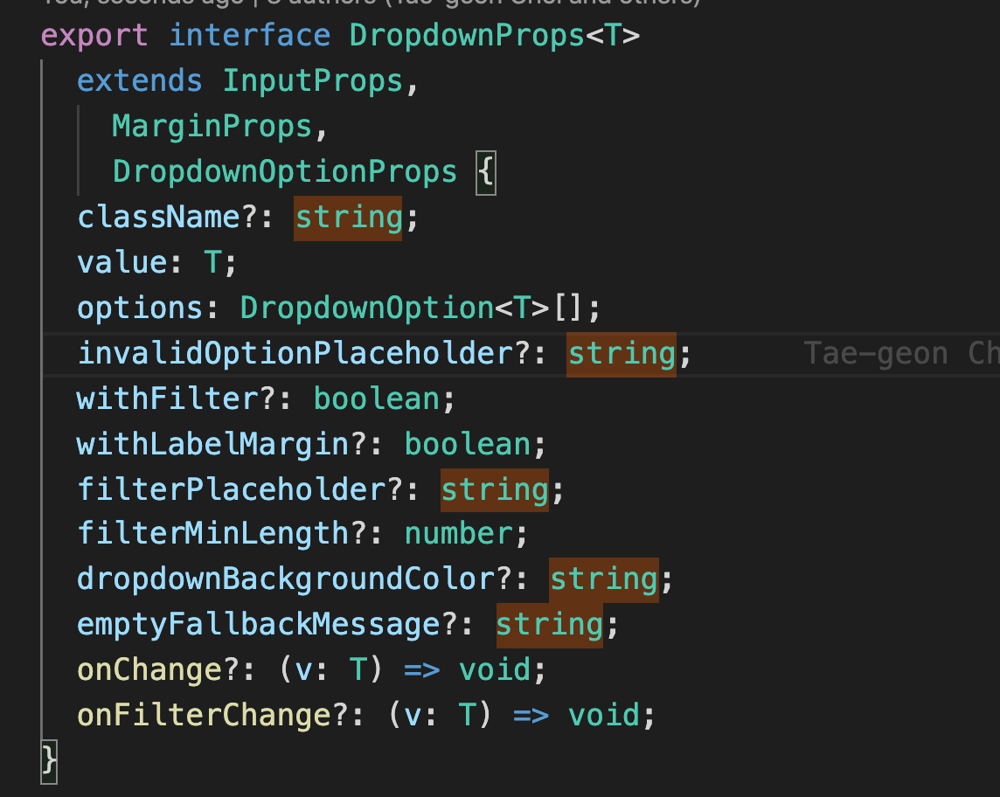

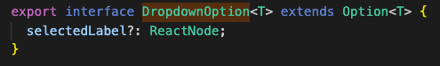

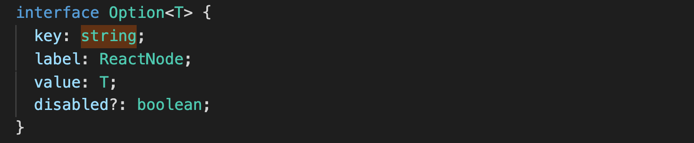

이제 수정된 프라퍼티를 컴포넌트가 사용하도록 코드를 수정한다.

FC를 사용하는 syntax 에서는 문법이 잘 작동하지 않기 때문에 프라퍼티 앞에 제너릭 선언을 해주고 그 제너릭을 prop에 적용시켰다.

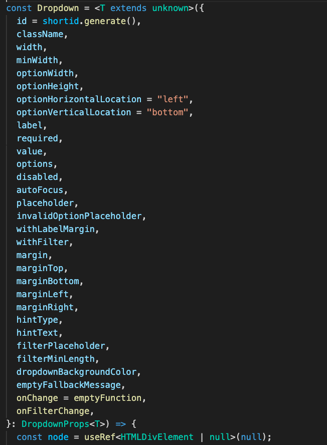

_extends unknown 을 굳이 한 이유는 arrow function 형태에서 `<T>` 이렇게만 하면 syntax 오류가 생기기 때문이다. 그렇게 사용하고 싶다면 일반 함수로 컴포넌트를 만들면 된다._

이제 컴포넌트가 제너릭 타입을 사용하니 사용처에 가서 options 타입을 확인해 보자

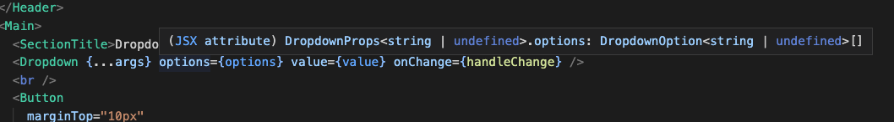

DropdownOption interface 에 사용되는 타입 형태가 실제로 input된 데이터 형태를 기반으로 `string | undefined`로 inference 된 것을 볼 수 있다.

만약 특정 사용처에서 input 타입을 강제하고 싶다면

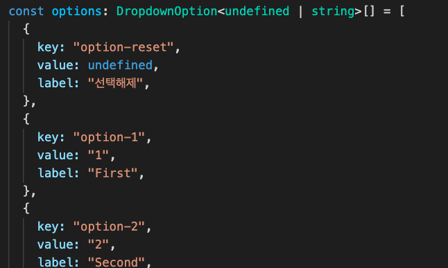

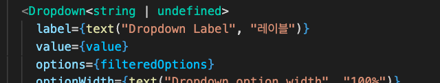

이렇게 컴포넌트를 사용하는곳에 타입을 정의해주면 된다.

우선은 현재 사용되는 value의 타입인 `<string | undefined>` 을 사용했다.

만약 타입을 그냥 `string`으로 비꿔주면 무슨 일이 생길까?

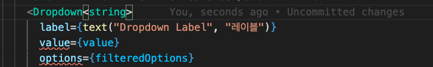

기존 options input을 options props에 넣으려고 하니 타입 오류가 생긴다.

단순 데이터가 아닌 오브젝트를 value 로 사용할때도 타입이 정해져 있기 때문에 훨씬 안전하게 사용이 가능하다.

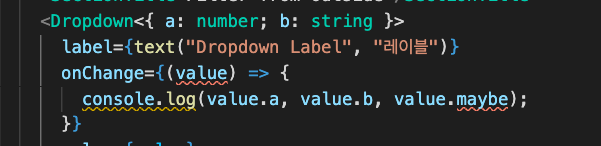

- [https://dev.to/janjakubnanista/a-peculiar-journey-to-a-generic-react-component-using-typescript-3cm8](https://dev.to/janjakubnanista/a-peculiar-journey-to-a-generic-react-component-using-typescript-3cm8)

- [https://www.reddit.com/r/typescript/comments/dv07sp/react_typing_generic_function_components/](https://www.reddit.com/r/typescript/comments/dv07sp/react_typing_generic_function_components/)

[돌아가기](../../README.md)
