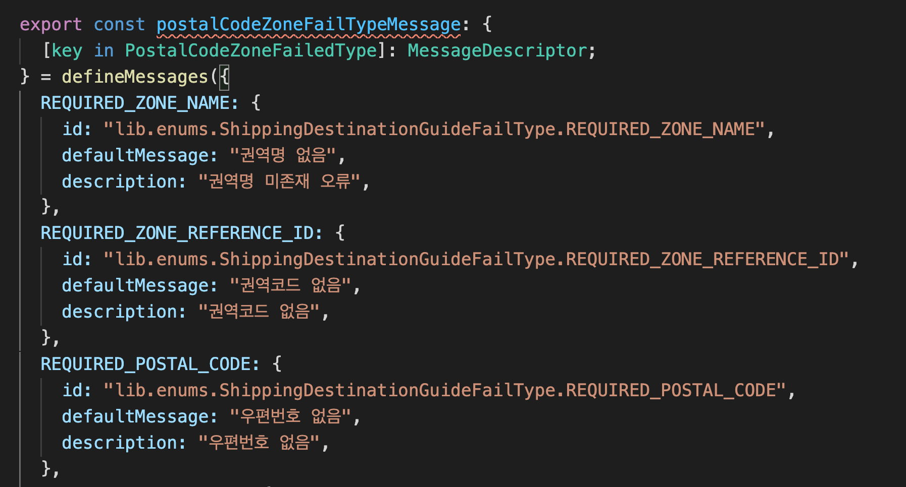
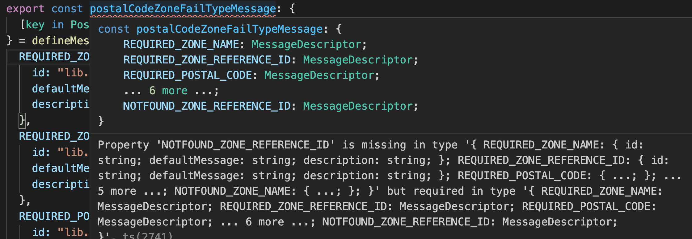

# Mapped types([key in Something])을 이용해 놓친 key, value 가 없는지 체크하기

[https://www.typescriptlang.org/docs/handbook/advanced-types.html#mapped-types](https://www.typescriptlang.org/docs/handbook/advanced-types.html#mapped-types)

개발중 큰 enum에 대해서 각 값들에 대한 mapping 데이터를 만들어야 하는 경우가 있었다.

```ts
export enum PostalCodeZoneValidationFailedType {
  REQUIREDZONENAME = "REQUIRED_ZONE_NAME",
  REQUIREDZONEREFERENCEID = "REQUIRED_ZONE_REFERENCE_ID",
  REQUIREDPOSTALCODE = "REQUIRED_POSTAL_CODE",
  INVALIDPOSTALCODE = "INVALID_POSTAL_CODE",
  DUPLICATEDZONEREFERENCEID = "DUPLICATED_ZONE_REFERENCE_ID",
  DUPLICATEDZONENAME = "DUPLICATED_ZONE_NAME",
  EXISTZONENAME = "EXIST_ZONE_NAME",
  EXISTZONEREFERENCEID = "EXIST_ZONE_REFERENCE_ID",
  NOTFOUNDZONENAME = "NOTFOUND_ZONE_NAME",
  NOTFOUNDZONEREFERENCEID = "NOTFOUND_ZONE_REFERENCE_ID",
}

const map = {
  REQUIRED_ZONE_NAME: {
    id: "lib.enums.ShippingDestinationGuideFailType.REQUIRED_ZONE_NAME",
    defaultMessage: "권역명 없음",
    description: "권역명 미존재 오류",
  },
  REQUIRED_ZONE_REFERENCE_ID: {
    id: "lib.enums.ShippingDestinationGuideFailType.REQUIRED_ZONE_REFERENCE_ID",
    defaultMessage: "권역코드 없음",
    description: "권역코드 없음",
  },
  REQUIRED_POSTAL_CODE: {
    id: "lib.enums.ShippingDestinationGuideFailType.REQUIRED_POSTAL_CODE",
    defaultMessage: "우편번호 없음",
    description: "우편번호 없음",
  },
};
```

위의 enum은 서버 업데이트에 따라 계속 추가되는데 이런 상황에서 타입지정이 되어있지 않으니
놓친 key, value는 없는지, 오타는 없는지 계속 불안하더라.

검색 후 이런 방법을 찾았다.



in something 문법을 사용해 key 타입을 정해 주면 something을 iterate해서 각 값들을 해당 타입의 key로 설정해 준다.

위 코드에서는 enum의 각 value들이 새로운 타입의 key 값들로 지정되게 되는데

빠진 key, value 가 있다면



이런 식으로 타입에러가 발생한다.

이제 api에서 enum에 슬쩍 값을 추가하더라도 좀 안심할 수 있을것 같다.

[돌아가기](/README.md)
