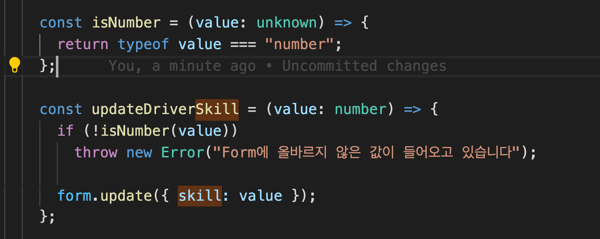

# 타입가드를 통해 런타임에 타입체크하기

[https://www.typescriptlang.org/docs/handbook/advanced-types.html](https://www.typescriptlang.org/docs/handbook/advanced-types.html)

회사의 라이브러리인 cake-form을 사용할 때
필드의 타입을 정해 두어도 실제 런타임에 다른 타입이 들어가면 문제가 없는 경우가 있어서
실제 서버에 값을 저장할때 문제가 생기는 경우가 있었다.

이렇게 number로 설정을 해두었는데
만약 런타임때 value가 스트링이어도

오류 없이 form에 값이 저장 되는 것을 볼 수 잇다.

하지만 타입가드를 사용해서 값 저장 전에 사용한다면

런타임에도 타입체킹을 해서 방어할 수가 있다.

cake-form과 타입 가드를 잘 녹여넣는다면 좀 더 믿을 수있게 form을 사용할 수 있을것 같다.
