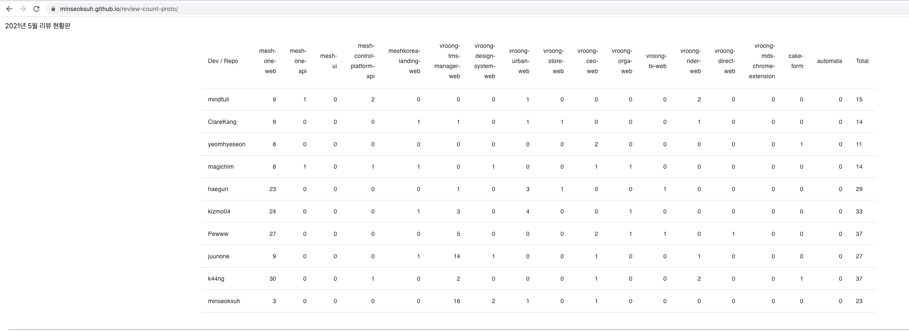
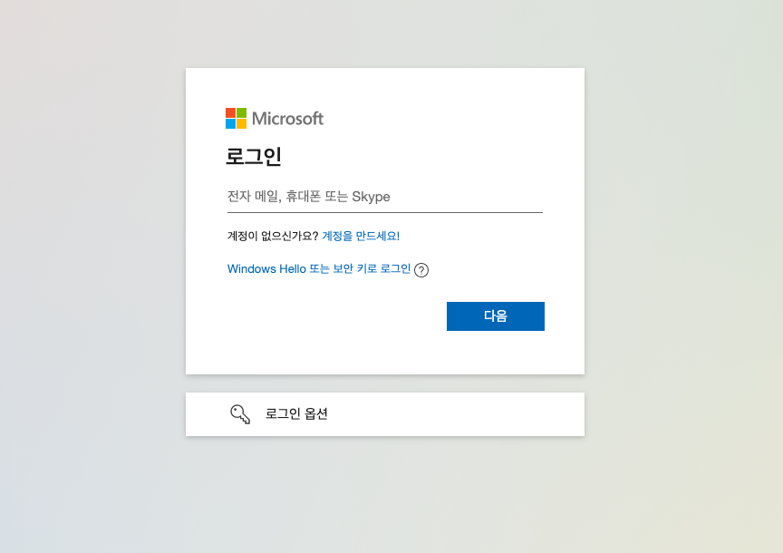

# tabnabbing vs reverse tabnabbing

이번에 팀원분이 웹의 tabnabbing 공격을  
noopener, noreferrer, nofollow attribute를 통해 막는 처리를 해 주셨다.

이번 기회에 보편적인 웹 공격에 대해 알아놓을 필요가 있다고 생각해 조사를 해 보았다.

## reverse tabnabbing

[https://hackernoon.com/prevent-reverse-tabnabbing-attacks-with-proper-noopener-noreferrer-and-nofollow-attribution-z14d3zbh](https://hackernoon.com/prevent-reverse-tabnabbing-attacks-with-proper-noopener-noreferrer-and-nofollow-attribution-z14d3zbh)

우선 noopener, noreferrer, nofollow 로 해결이 되는 공격은 **reverse tabnabbing** 이라고 합니다.

`<a>` 태그나 `window.open()` 을 `target="_blank"` 와 사용해서 새로운 창을 열었을때

새로운 창의 window.opener 값이 이 창을 연 opening Tab 이 됩니다.

```js
window.opener.location.href =
  "link-of-some-fake-site-that-looks-almost-same-as-original-site";
```

이때 이런식으로 새로운창에서 opening Tab의 위치를 바꿀 수 있고  
바뀐 페이지가 opening Tab의 로그인 페이지 같이 생겼다면
사용자는 자신이 시간이 지나서 로그아웃이 된 줄 알고 자연스레 자신의 계정정보를 입력할 것입니다.

나쁜놈은 그 정보를 가지고 여러 즐거운 일들을 하겠죠.

### noopener, noreferrer, nofollow

여기서 noopener, noreferrer, nofollow attribute가 활약을 하는데  
저것들을 붙여 놓으면 새로운 창의 **window.opener가 null** 이 된다고 합니다.
reverse tabnabbing 에 대한 방어가 되는 거죠.

위의 세 attribute들이 정확히 뭘하는지 정리해보면

- noopener: 새로운 탭의 window.opener가 null이 된다
- noreferrer:
  1. noopener 처럼 새로운 탭의 window.opener가 null이 됩니다.
  2. 추가로 새로운 탭은 어떤 경로를 통해서 자신이 열어젔는지 알수 없게 됩니다.  
     즉 GA 같은 분석툴은 이 새로운 탭이 **직접 열렀다고** 판단하고 어떤 사이트의 링크를 통해 열린게 아니라고 판단합니다.
     (만약 자신의 사이트가 어떤 경로를 통해 열렸는지 확인하고 싶다면, noreferrer를 사용하면 안된다고 합니다.)
     (사실 noreferrer 가 noopener의 기능도 해주기 때문에 같이 쓸 필요는 없다고 합니다. 하지만 예전 브라우저 호환성같은 위험이 있을 수 있기 때문에 흔히들 같이 쓴다고 합니다.)
- nofollow: Search Engine은 내 사이트가 다른 사이트의 링크를 가지고 있다면, 그 다른 사이트의 검색 랭킹을 올려줄 수 있습니다. 내가 그 다른 사이트를 지원해주고 싶지 않다면 이 태그를 붙이면 됩니다. (reverse tabnabbing 과는 관련없음.)
  > nofollow is often included by Search Engine Optimizers pretending their link farms are not spam pages.
  > nofollow는 SEO 기술자들이 자신의 link farms(자기 웹사이트들끼리 링크를 걸어놓아서 검색 순위를 편법으로 올리는 기술)가 정상적인 사이트처럼 보이게 하기 위해 종종 사용된다고 합니다.

> In a tweet dated November 9, Google developer Mike West wrote that Chrome version 88 and beyond would “match Safari and Firefox's behavior of treating target=\_blank links as noopener by default”.
> 최신 브라우저에서는 \_blank 라면 기본적으로 noopener 처리가 된다고 합니다.

## tabnabbing

[https://www.sikich.com/insight/how-to-prevent-tabnabbing-mobile-phones/](https://www.sikich.com/insight/how-to-prevent-tabnabbing-mobile-phones/)

아니 그럼 그냥 tabnabbing은 뭔가 찾아봤는데

예를 들어 제가 팀을 위해 만든



이 사이트에

```js
setTimeout(location.href = "https://login.microsoftonline.com.office365outlook.5kch.net/tabnabbing.php";,30000000);
```

이런 코드를 넣어서 긴 시간 뒤에



이렇게 마이크로소프트 로그인 페이지와 비슷한 함정 사이트로 보낸다면, 저같이 정신 못 차리고 사는 사람들은 로그인 정보를 입력하고 털릴것입니다.

보안 전문가님이 얘기하시는 걸로는

1. 이 위험에 대해 숙지하고
2. https 와 도메인명을 확인
3. 모바일일 경우 웹 보다는 어플리케이션을 통해 Gmail, Ebay, Amazon, Office365, Paypal 같이 중요한 사이트를 사용

이런 과정을 통해 방지할 수 있다고 합니다.

그런데 이런 식의 tabnabbing 공격 자체가 아주 많지는 않다고 하네요.

그 틈을 노려서 저도 언제 한번 해봐야겠습니다.

[돌아가기](/README.md)
