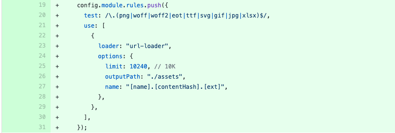
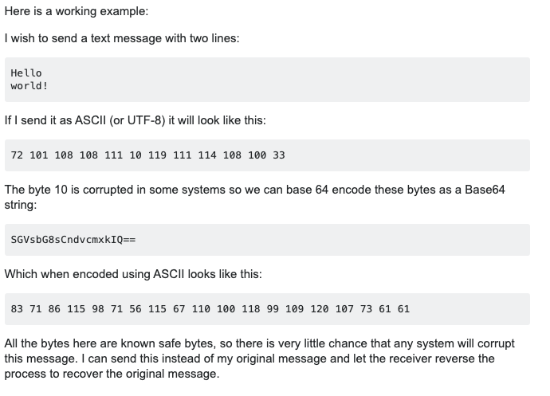

# base64

TMS src에 xlsx 파일이 들어가서

webpack에서 파일을 처리해 줄 수 있는 loader가 추가되었다.

정확히 무슨 일을 하는 건지 알아봤더니

"A loader for webpack which transforms files into base64 URIs."

파일을 base64 URI로 변환하는 로더라고 한다.

base64가 뭔지 이해가 안되서 조사를 해보았다.

[https://stackoverflow.com/questions/3538021/why-do-we-use-base64](https://stackoverflow.com/questions/3538021/why-do-we-use-base64)

- Base64 encoding schemes are commonly used when there is a need to encode binary data that needs be stored and transferred over media that are designed to deal with textual data.
- 바이너리 데이터를 미디어를 통해 저장하거나 넘겨주어야 할때 사용되는 인코딩 방식. Base64를 사용해서 데이터가 이동시에 이상하게 변하지 않도록 방지하기 위함.
- ASCII 인코딩 : 텍스트 스트링을 바이트로 바꾸는 인코딩
- Base64 인코딩: 바이트를 텍스트 스트링으로 바꾸는 인코딩

일반적으로 byte 단위로 바이너리 데이터가 저장되는데 7bit인 ASCII는 이런 데이터를 이동시키기에는 부적합함
또한 ending encoding (개행 문자같은)이 시스템별로 달라서 ASCII 10, 13 번 같은 문자가 오해되는 경우가 있음
위 같은 이유 때문에 Base64이 사용됨.

데이터를 안정적으로 보내기 위한 프로세스

1. 텍스트를 utf-8같은 텍스트 인코딩을 통해 바이트로 전환
2. 나온 바이트 값을 Base64 스트링으로 전환해서 전송
3. 받는 입장에서는 Base64 스트링을 바이트로 전환한 후
4. 보낸쪽이 사용한 텍스트 인코딩을 통해 바이트를 스트링으로 전환

base64를 사용하기 위한 Window.btoa, Window.atob
