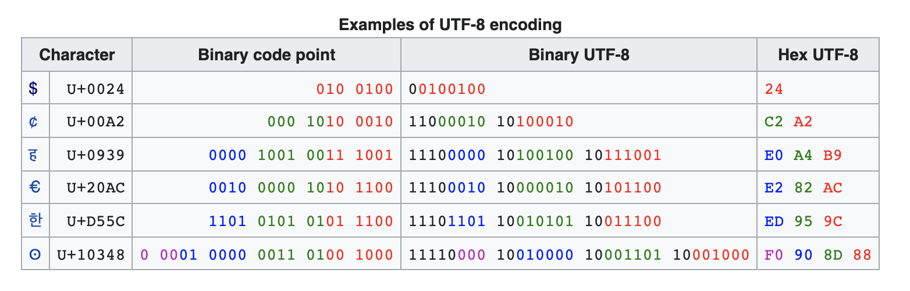

# encodeURIComponet & UTF-8

encodeURIComponet를 확인했다.

> The encodeURIComponent() function encodes a URI by replacing each instance of certain characters by one, two, three, or four escape sequences representing the UTF-8 encoding of the character (will only be four escape sequences for characters composed of two "surrogate" characters).

- 특정 문자들을 UTF-8 인코딩 값으로 바꿔 url에서 reserved된 문자들과의 충돌로 생길 수 있는 문제를 막는다.

## Unicode (Universal Character Set) & UTF-8

그런데 UTF-8을 잘 몰라서 조사해 봤다.

- Unicode는 특정한 숫자값(code point)에 특정한 문자를 map 시켜주는 규약. code point x3A(58)는 UTF-8이든 UTF-16이든 똑같이 ":" 이다.
- 1,112,064 개의 code points가 Unicode 에 있음
- UTF-8, UTF-16은 이 숫자를 어떻게 데이터로 표현 할 것이냐를 정하는 룰.
  - UTF-8 에서 "$": 0024
  - UTF-16 에서 "$": feff0024



- utf-8은 byte를 1 ~ 4개 까지 사용해서 code points들을 표현 한다.
  - 1 byte: ASCII (backwards compatible, ASCII 문자만 포함된 utf-8 문서라면 ASCII 시스템에서 작동 가능)
  - 2 byte: almost all Latin-script alphabets, and also IPA extensions, Greek, Cyrillic, Coptic, Armenian, Hebrew, Arabic, Syriac, Thaana and N'Ko alphabets, as well as Combining Diacritical Marks. 
  - 3 byte: Basic Multilingual Plane: , which contains virtually all characters in common use,[14] including most Chinese, Japanese and __Korean characters__.
  - 4 byte: characters in the other planes of Unicode, which include less common CJK characters, various historic scripts, mathematical symbols, and emoji (pictographic symbols).

- 1 바이트는 앞에 "0" 버퍼가 붙는다. ("0"0100100, 7bit available)
- 1 바이트 이상 부터는 일종의 버퍼로 필요한 바이트 수만큼 앞에 1이 붙고 0이 따른다 (ex: 3바이트여서 "1110"0000 10100100 10111001)
- 1 바이트 이상 부터는 이어지는 바이트에 "10" 버퍼가 붙는다. 각 6비트 제공. (ex: 3바이트여서 11100000 "10"100100 "10"111001)
- 2 바이트 (11000010 "10"100010, 11bit available)
- 3 바이트 (16bit available)
- 4 바이트 (20bit available)

## ```html <meta charset="utf-8" />```

> This attribute declares the document's character encoding. If the attribute is present, its value must be an ASCII case-insensitive match for the string "utf-8", because UTF-8 is the only valid encoding for HTML5 documents. ```<meta>``` elements which declare a character encoding must be located entirely within the first 1024 bytes of the document.

이 태그를 사용한다면 값은 "utf-8" 밖에 허락하지 않음. UTF-8은 HTML5에서 사용가능한 유일한 인코딩이기 때문

## html에서 왜 escape을 제공하나요?

- [https://www.w3.org/International/questions/qa-escapes](https://www.w3.org/International/questions/qa-escapes)

ASCII 문자만을 사용해 unicode 문자를 사용하게 해주기 위해


> Because you should use UTF-8 for the character encoding of the page, you won't normally need to use character escapes. You may however find them useful to represent invisible or ambiguous characters, or characters that would otherwise interact in undesirable ways with the surrounding source code or text.

어차피 encoding 자체가 UTF-8 로 제약이 있기 때문에 escape을 별로 사용할 일이 없겠지만, 보이지 않는 문자나 불확실한 문자, 또는 주위에 영향을 줄수 있는 문자들 때문에 골치 아플때 사용하면 된다.

## UTF-16

- 최소 2바이트를 사용하기 때문에 ASCII compatibility가 없음.
- Window OS 같은데서 많이 사용한다고 함.
- 거의 UTF-8을 많이 사용하고 예전에 UTF-16을 많이 썻던곳도 UTF-8을 지원하도록 바뀐다고 함.

그냥 UTF-8만 잘 이해하고 쓰면 될듯 하다.

## Reference

- [https://developer.mozilla.org/en-US/docs/Web/JavaScript/Reference/Global_Objects/encodeURIComponent](https://developer.mozilla.org/en-US/docs/Web/JavaScript/Reference/Global_Objects/encodeURIComponent)
- [https://developer.mozilla.org/en-US/docs/Web/HTML/Element/meta](https://developer.mozilla.org/en-US/docs/Web/HTML/Element/meta)
- [https://en.wikipedia.org/wiki/UTF-8](https://en.wikipedia.org/wiki/UTF-8)
- [https://en.wikipedia.org/wiki/Universal_Character_Set_characters](https://en.wikipedia.org/wiki/Universal_Character_Set_characters)


[돌아가기](/README.md)
