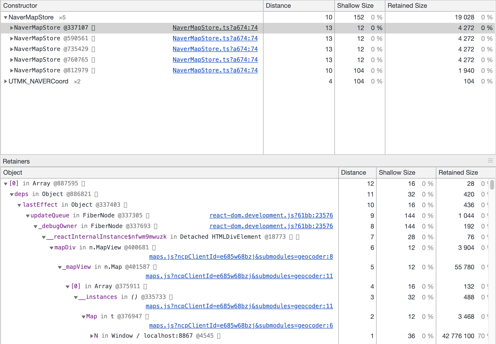
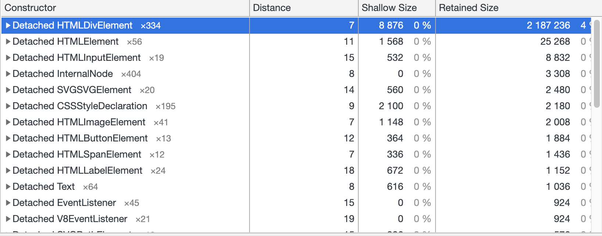

# Heap Snapshot

메모리에 제거되어야 하는 레퍼런스가 남아있어 생긴 버그를 해결하면서

Chrome Devtool에 있는 heap snapshot을 사용해볼 기회가 있었다.

위 같은 경우에 네이버 지도가 구현되는 페이지를 몇번 왔다 갔다 하면 위쪽 섹션에 보이는 것처럼 NaverMapStore가 Garbage Collection이 되지 않고 살아있는걸 볼 수 있다.

보여지는 데이터들을 정리해 보면

- Distance : window에서부터의 노드 거리
- Shallow Size: 오브젝트 자체의 메모리 사용량
- Retained Size: 오브젝트에 연결되어 있는 다른 오브젝트까지 포함한 총 메모리 버든

각 오브젝트를 클릭해보면 화면 하단 섹션에 해당 오브젝트가 Window까지 연결 되는 경로를 확인할 수 있는데  
여러 경로가 있을 수 있어 짧은 경로 순으로 정렬이 되서 표시가 된다.

왼쪽에 있는 색으로 칠해진 글자가 property, 오른쪽에 있는 글자가 Constructor 명으로 표시된 Object를 나타내는데

이 경우

> Array[0] < Object.deps < Object.lastEffect < FiberNode.updateQueue < FiberNode_debugOwner < Detached HTMLDivElement.\_\_reactInternal < n.MapView.mapDiv ... < Window.N

이렇게 타고 window 객체에 까지 다다르는 것을 볼 수 있다.

- Detached HTML Element 는 현재 DOM에서는 떨어져 있으나 javascript 상으로는 연결되어 있어 GC가 되지 않는 DOM 엘레멘트를 말한다

> A DOM node can only be garbage collected when there are no references to it from either the page's DOM tree or JavaScript code. A node is said to be "detached" when it's removed from the DOM tree but some JavaScript still references it. Detached DOM nodes are a common cause of memory leaks.

같은 스냅샷에서 Detached HTMLDivElement를 보면 Retained Size 바이트 값 오른쪽에 4%라고 쓰여있는데
해당 메모리 힙에 4퍼센트를 사용한다는 말이다.
계속 지도 페이지를 왔다갔다하니 Detached HTMLDivElement가 늘어나며 퍼센테지가 계속 올라가는 걸 확인할 수 있었다.

적지 않은 메모리이니 만큼 큰 메모리 Leak은 잘 분석해서 해결할 수 있으면 좋을것 같다.

[https://developers.google.com/web/tools/chrome-devtools/memory-problems/heap-snapshots](https://developers.google.com/web/tools/chrome-devtools/memory-problems/heap-snapshots)

[돌아가기](/README.md)
