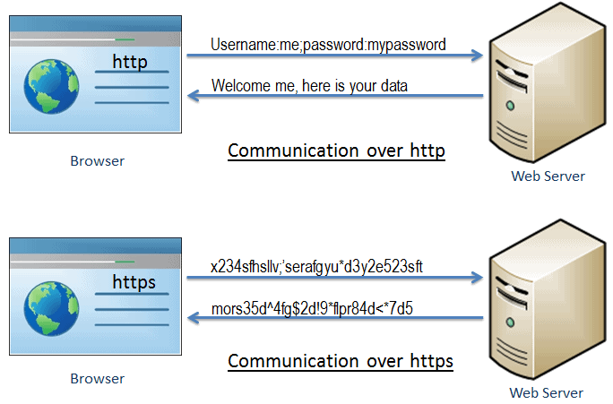
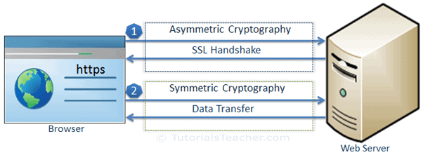
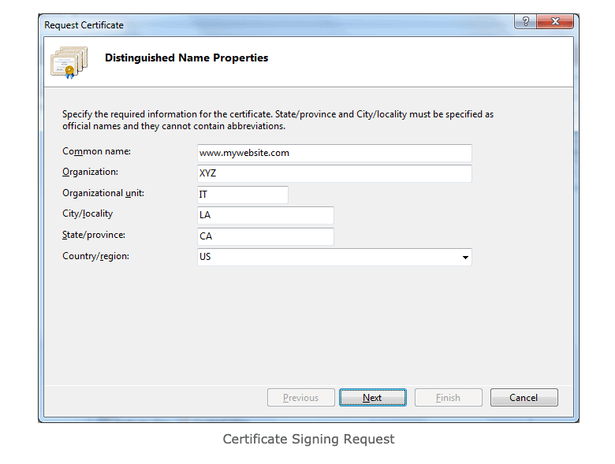
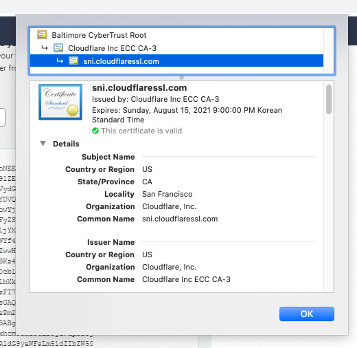
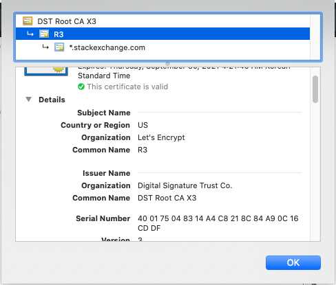
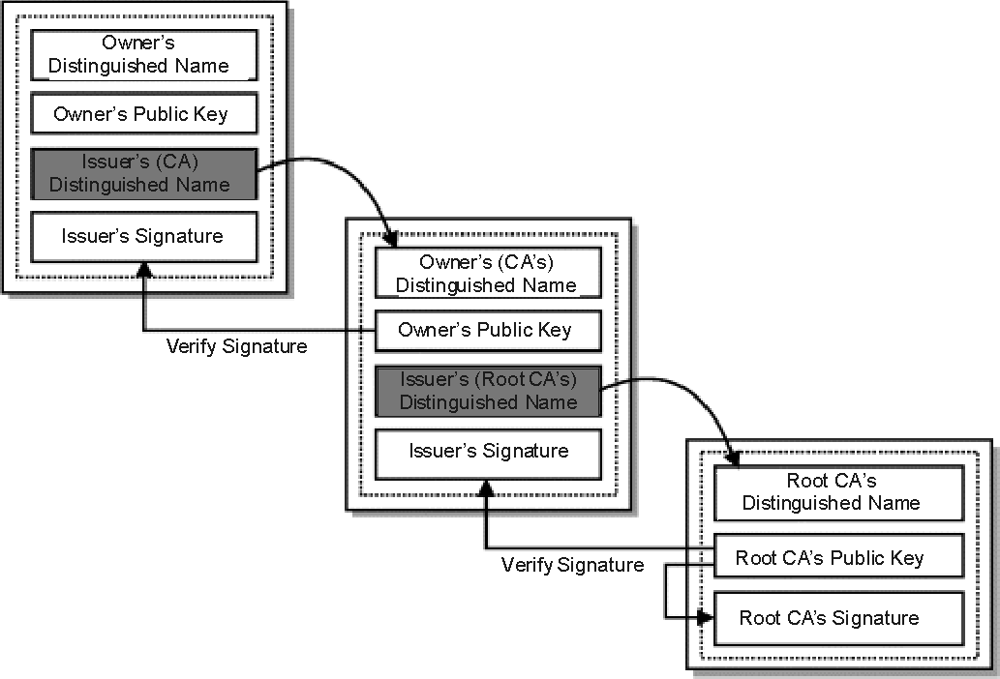

# HTTPS를 이해해보자

웹개발을 시작한지 어언 2년...

이제는 HTTPS를 알아야 되지 않흘까 라고 생각해서 나 나름대로 이해해 본것을 정리해봅니다.

## HTTPS해서 뭐가 좋나요?

간단하게 말해서 서버와 클라이언트가 주고 받는 데이터가 암호화 되어서 움직이는 데이터가 뭔지 제 3자가 알수가 없습니다.

이 이점으로 파생되는 부가적인 이점들이 많습니다만, (SEO 랭킹이 올라간다던가, 네트워크 성능이 좋아진다던가)  
핵심은 위의 그림으로 표현되는 암호화 효과라고 생각합니다. (SSL / TLS 프로토콜을 사용해서 이 효과를 만들어낸다고 하네요.)

## HTTPS는 어떻게 동작하고 왜 안전하나요?

위의 그림을 보면

1. SSL HandShake라는 과정이 선결되고

2. Data 전송이 이루어지는데

핸드셰이크에서 사용되는 Asymmetric Cryptography의 특징이 HTTPS의 안정성을 이해하는데 중요합니다.

- 비대칭 (Asymmetric) 암호술: 암호화에 사용되는 key와 복호화에 사용되는 key가 다름

- 대칭 (Symmetric) 암호술: 암호화에 사용되는 key와 복호화에 사용되는 key가 같음

HTTPS 의 흐름안에서는 일반적으로 private key, public key 로 비대칭 key들이 불리는데  
서버는 아주 안전하게 private key를 노출하지 않고 관리하고  
public key를 포함한 인증서를 클라이언트에 보내서, 핸드셰이크 프로세스를 진행합니다.

### 핸드셰이크 과정

1. (Client) 클라이언트가 "client hello" 메세지를 서버에 보냄. 이때 SSL / TLS 에 필요한 부가정보들도 보냅니다. 예를 들자면 사용하는 SSL 버전이라던가...

2. (Server) 서버가 "server hello" 메세지를 돌려줍니다. **핵심적으로 서버는 이때 인증서(Certificate: 서버의 public key와 다른 SSL 관련 데이터가 포함된 데이터)를 보내야 합니다.**

3. (Client) 클라이언트는 인증서에 대한 검증을 해서, 자신이 통신하고 있는 서버가 실제로 자신이 주장하는 서버가 맞는지 확인합니다. (예를 들어 google.com에 접속했을 시, 실제로 구글 서버에서 response가 돌아오는지 아니면 google 인척하는 나쁜 사람이 response를 돌려주는지)

4. (Client) 만약 3번이 통과되었다면 클라이언트는 Data Transfer에 사용될 session key를 만들고, 그 session key를 public key로 암호화 해 서버에 보냅니다. (만약 서버가 클라이언트에 인증서를 요구한다면 이 단계에서 같이 보냅니다.)

5. 서버는 자신만 알고 있는 private key를 사용해 session key(public key로 암호화 되어 있는)를 복호화 하고 핸드셰이크가 정상적으로 완료되었다는 확인 메세지를 session key를 통해 암호화 해서 보냅니다.

이후로는 클라이언트와 서버만 알고 있는 session key로 데이터를 암호화하고 복호화하면서 데이터 전송을 합니다.

### 클라이언트는 어떻게 서버에서 보내는 인증서를 검증하나요?

제가 가장 이해하기 어려웠던 부분입니다.

도대체 클라이언트는 어떤 과정을 통해 서버가 보내준 인증서가 믿을만한지 확인하는 것 일까요?

여기서 CA(Certificate Authorities: 인증 권위 단체)가 역활을 합니다.

내가 대화하는 상대방이 아무리 자신을 믿을만하다고 해봐야 신뢰가 생기지 않기 때문에,

믿을수 있는 제 3자가(CA) "이 사람은 믿어도 된다" 라고 말해주는것을 통해 신뢰를 하는것 입니다.

#### 인증서가 발급되는 과정

서버가 https를 사용하기 위해서는 인증서를 공인된 CA (에를 들어 CloudFlare)로부터 받아야 하는데

도메인명, 회사명, 위치, public key 등의 정보를 포함해 인증서 발급을 해당 기관 신청합니다.

CA는 (인증서 보안 등급, 인증서가 커버할수 있는 subdomain 수 등에 따라) 신청자가 믿을만한지 검증하는 시간을 가지고,

만약 믿을만 하다면 **CA의 private key를 사용해 인증 관련 데이터를 암호화해서, 인증서에 들어갈 서명을 만들어 냅니다.** 그리고 인증서를 서버에 발급합니다.

바야흐로 우리가 url 창 옆에 자물쇠를 눌러서 확인할수 있는 인증서가 만들어지는 거십니다.

#### 다시 본론으로 돌아가서

클라이언트가 이렇게 발급된 인증서를 받으면,

**OS나 브라우저에 기본 설치되어 있는 "신뢰할 수 있는 CA 인증서 목록(TrustStore)" 중 해당 CA의 public key를 찾아 전자서명 복호화를 시도합니다.**

> [https://support.apple.com/ko-kr/HT209144](https://support.apple.com/ko-kr/HT209144) 에서 애플이 자사 제품에 설치한 해당 CA 목록을 확인할 수 있습니다.

예를 들어 어떤 서버가 "Amazon Root CA 1"에게 인증서를 발급받았다고 하면,

클라이언트는 이미 로컬 디바이스에 존재하는 TrustStore 안에서 "Amazon Root CA 1"의 인증서를 찾아,

그 인증서에 있는 public key로 서버에서 준 인증서 속 전자서명을 복호화 하려고 합니다.

만약 전자서명을 한 key가 공개된 public key에 대응하는 "Amazon Root CA 1"의 진짜 private key가 아니라면, 복호화는 실패할 것이고

브라우저는 이 인증서에 문제가 있다고 판단 https 핸드셰이크를 중단할 것입니다.

#### Certificate Paths

일반적으로 서버가 받는 인증서들은 자체서명이 가능한 (self-signed certificate) ROOT CA에서 직접 발급된게 아니라,

그 루트 CA 가 신뢰하는 부속 CA들을 통해 발급되는 경우가 대부분입니다.

stackExchange의 인증서를 발급한 R3는 자신의 인증서를 DST ROOT CA X3에서 발급받았습니다.

핸드셰이크시 해당 서버 인증서에 관계한 CA들의 인증서가 모두 같이 발송되고.

브라우저는 이 인증서들의 서명을 발급자 (상위 CA)의 public 키를 사용해가며 검증 할 수 있고,

결국 ROOT CA가 신뢰를 하는 사이트 라는것을 확인할 수 있는 것입니다.

### 마치며

CA가 인증서에 포함한 서명을 public key로 검증하는 과정이라던가 정확하지 않은 부분이 많을테지만,

public key와 private key를 통해 클라이언트와 서버가 어떻게 신뢰를 쌓는지 대략적인 흐름은 제대로 이해한 것 같습니다.

## 참고

- [https://robertheaton.com/2014/03/27/how-does-https-actually-work/](https://robertheaton.com/2014/03/27/how-does-https-actually-work/)
- [http://www.moserware.com/2009/06/first-few-milliseconds-of-https.html](http://www.moserware.com/2009/06/first-few-milliseconds-of-https.html)
- [https://stackoverflow.com/questions/188266/how-are-ssl-certificates-verified](https://stackoverflow.com/questions/188266/how-are-ssl-certificates-verified)
- [https://www.tutorialsteacher.com/https](https://www.tutorialsteacher.com/https)

[돌아가기](../../README.md)
