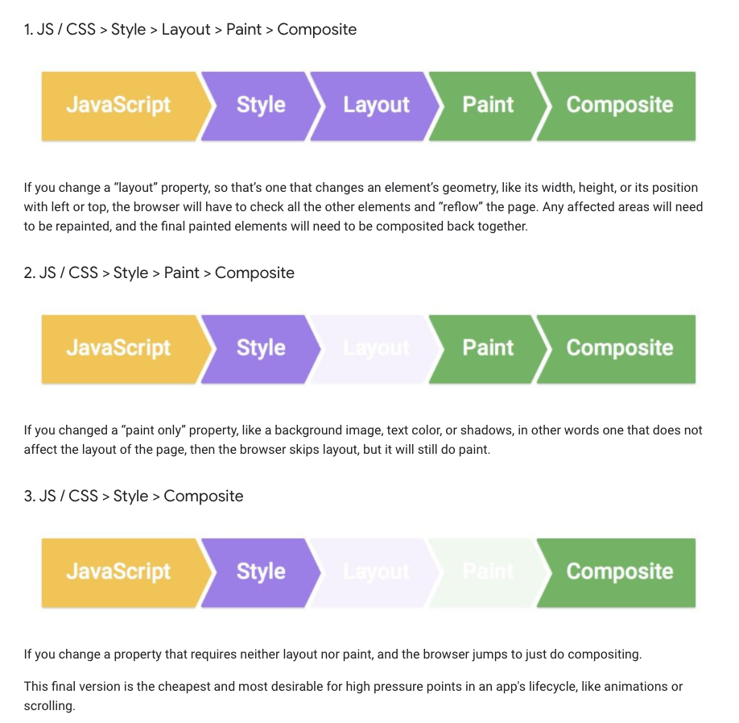
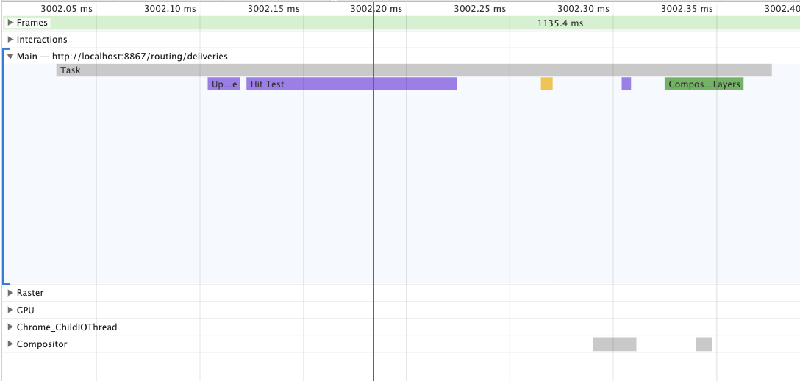

# 브라우저의 화면은 어떻게 업데이트가 되나요

[https://developers.google.com/web/fundamentals/performance/rendering](https://developers.google.com/web/fundamentals/performance/rendering)

최초 로드시 페이지가 어떻게 렌더 되는지와는 별개로

페이지의 view가 어떻게 인터렉티브하게 업데이트 되는지 알아보고 싶었다.

리액트 같은 Client Side Rendering 같은 경우 routes 변환 같은 새 페이지 구성도 실제로는 JavaScript를 통해 업데이트 되는 것이기 때문에 업데이트 Render 파이프라인을 잘 알고 있는게 중요하다고 생각했다.

- 일반적으로 브라우저는 1초에 60번 화면을 refresh 한다고 한다.
- 계산하면 16ms에 한번 화면이 업데이트 되어야 하는데, 브라우저는 화면 업데이트 말고 다른 일도 처리해야 되기 때문에 실제로는 10ms 내에 화면 처리가 끝나야 뚝뚝 끊기지 않는 부드러운 ux를 제공할수 있다고 한다.

1. JavaScript: 보통 자바스크립트로 인해 비쥬얼 업데이트가 생겨서 JavaScript라고 했지만, css animation, transition 등 비쥬얼 업데이트를 만드는 모든 것을 포함하는 표현한다.

   

   > 간단한 마우스 이동에도 JavaScript > style > composite layer 파이프라인이 작동하는 것을 볼 수 있다.

2. style calculation: 어떤 css 룰이 엘레멘트에 적용되는지 계사하는 과정
3. layout: 각 엘레멘트가 화면에 차지하는 영역을 계산
4. paint: 실제로 픽셀을 색으로 채워서 그리는 작업
5. composite: 어떤 레이어가 위로 올라가는지 정하고 그리는 작업 (z-index?)

JavaScript, Style, Layout, Paint 각각 단계가 실행되어야 하는지 파악하고 필요한 프로세스가 실행이 된다.

> 위의 그림에는 JavaScript, Style 단계는 언제나 들어가는 걸로 나오는데,
> 실제로는 JavaScript, css 변화 없이 (예를 들어 윈도우를 resize 한다거나) Layout, Paint 단계가 실행이 되는 경우도 있다.

css property 별로 layout, paint 단계가 들어가는지 브라우저가 정의를 하고 있는데  
[https://csstriggers.com/](https://csstriggers.com/)  
여기에 가보면 어떤 css property가 어떤 렌더 단계를 발생시키는지 정리를 해 놓았다.

[https://flaviocopes.com/requestanimationframe/](https://flaviocopes.com/requestanimationframe/)
