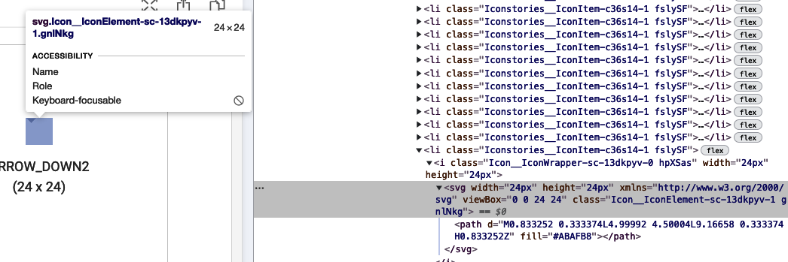
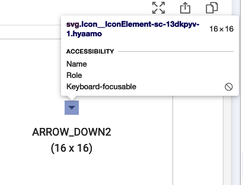
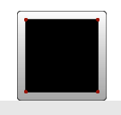
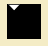
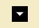

# svg - path 이해하기

디자인팀에서 만들어 주신 svg를 기존 Icon 컴포넌트로 감싸고 보니



이렇게 svg가 차지하는 영역 좌측 상단에 위치하는 상황이 생겼다.

알고보니 Icon 컴포넌트가 자체적으로 svg를 감싸주는데 default 값으로 svg의 width, height, viewBox.width, viewBoxHeight를 24로 설정해주고 있더라. default 값을 쓰지 않도록 해당 아이콘의 수치들을 props로 제대로 넣어주니 해결되었다.

하지만 내가 svg에 대해 너무 모르고 있는것 같아 이번 기회에 내가 원하는대로 직접 수정해보면서 이해해보고 싶었다.



16px 16px 범위 안에 디자인 팀이 주신 규격의 도형이 정가운데 위치하게 해보려고 한다.

## path

[https://developer.mozilla.org/en-US/docs/Web/SVG/Tutorial/Paths](https://developer.mozilla.org/en-US/docs/Web/SVG/Tutorial/Paths)

- 우선 path는 svg 안에 넣을수 있는 여러 가지 도형 중에 하나로, (ex: `<rectangle />`, `<circle />` 등) 가장 자유롭게 사용할수 있는 도형이라고 한다. 

- polyline도 path 처럼 여러 선으로 도형을 만들수 있지만, path는 곡선을 표현할수 있다는 점에서 더 자유도가 높다고 할 수 있다. (이 글에서는 직선에 관해서만 다루려고 한다.)

`<path d="..." />` 이런 식으로 `d` attribute를 받는데 draw 할 내용이라는 점에서 그런 이름인가보다.


svg도 canvas 처럼 y가 값이 커질수록 내려가는 그리드 시스템을 사용한다.

### Line Commands

path로 선을 그릴때 5가지 명령어를 사용할 수가 있다.

- M, m: 좌표 위치 이동 (그리지 않고 위치만 이동) (ex: M x y)
- L, l: 전 좌표로부터 해당 좌표로 선 그리기 (ex: L x y)
- H, h: 전 좌표로부터 수평선 그리기 (ex: H x)
- V, v: 전 좌표로부터 수직선 그리기 (ex: H y)
- Z, z: 마지막 좌표에서부터 최초 좌표까지 선을 그려서 도형 완성

- __!: 대문자와 소문자의 차이점은 대문자는 절대 좌표를 가르키는 방면, 소문자는 전 좌표로부터 상대적인 거리로 현 좌표 위치를 표현한다. (z는 영향없다고 함)__
- H 와 V는 수직, 수평선을 그리기 때문에 값을 하나밖에 받지 않는다. H - x, V - y



위의 직사각형을

```svg
<path d="M 10 10 h 80 v 80 h -80 Z" />
```

이 path로 그릴수 있는데, 하나 하나 뜯어보면

1. 좌표 x:10 y:10으로 이동 (M, 절대 좌표)
2. 좌표 수평으로 80 이동 > x:90 y:10 (h, 상대 좌표)
3. 좌표 수직으로 80 이동 > x:90 y:90 (v, 상대 좌표)
4. 좌표 수평으로 -80 이동 > x:10 y:90 (h, 상대 좌표)
5. 마지막 지점에서 최초 점까지 선으로 마무리 (Z)

이런 식이다

## 적용

최초 문제가 있었던 svg를 보면 형태가 아래와 같다.



```svg
<svg width=24 height=24 viewBox="0 0 16 16" style="background-color:red">
  <path d="M0.833252 0.333374L4.99992 4.50004L9.16658 0.333374H0.833252Z" fill="black" />
</svg>
```

디자인팀 분들이 주신 svg의 시작점이 0,0 으로 딱 떨어지지 않는다.  
역삼각형의 규격을 계산해 보면  
width: 8.333328  
height: 4.166666  
이 나오니 0,0 좌표에서 부터 저 사이즈를 가지고 계산을 하면 될것 같다.

나는 width=16, height=16의 범위 안에서 정 가운데에 위치하게 하고 싶기 때문에  
시작점을 계산해보면  

x: (16 - 8.333328) / 2 = 3.833336  
y: (16 - 4.166666) / 2 = 5.916667

가 된다.

`d="M3.833336 5.916667"`

여기에서 수평으로 선을 width 만큼 그려주고

`d="M3.833336 5.916667 h8.333328"`

그 다음에는 수직으로 height 만큼 수평으로 -(width/2) 만큼 선을 그려준다.

`d="M3.833336 5.916667 h8.333328 ㅣ-4.166664 4.166666"`

마지막으로 마무리 Z

`d="M3.833336 5.916667 h8.333328 ㅣ-4.166664 4.166666Z"`



```svg
<svg width=16 height=16 viewBox="0 0 16 16" style="background-color:red">
  <path d="M3.833336 5.916667 h8.333328 l-4.166664 4.166666Z" fill="black" />
</svg>
```

위와 같이 내가 원하는 형태로 만들수 있었다.

언제나 svg는 보기 싫고 대하기 어려운 주제들 중 하나였는데, 오늘 어느 정도 극복해낸것 같다 다행이다.

[돌아가기](../../README.md)
